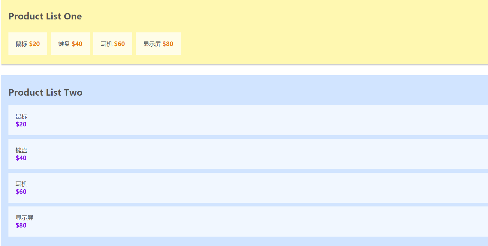
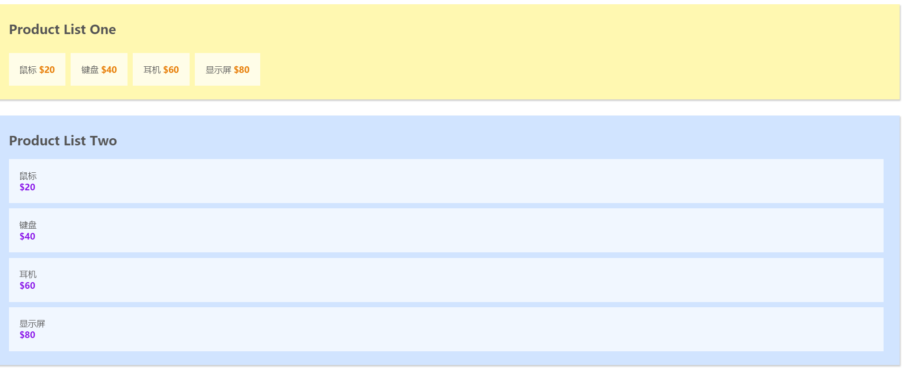
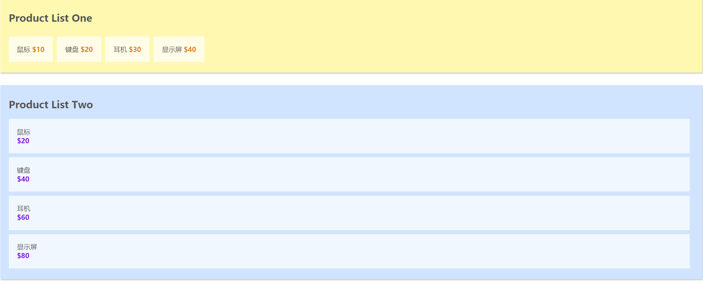
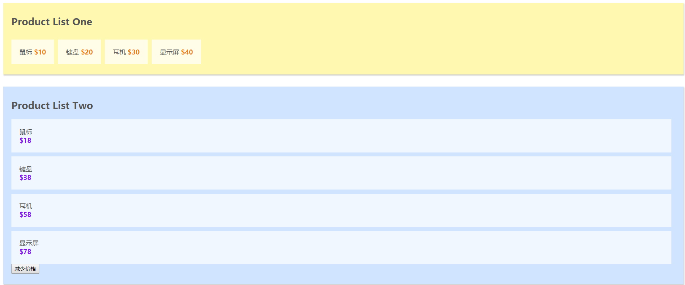
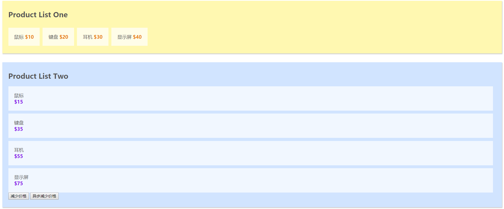
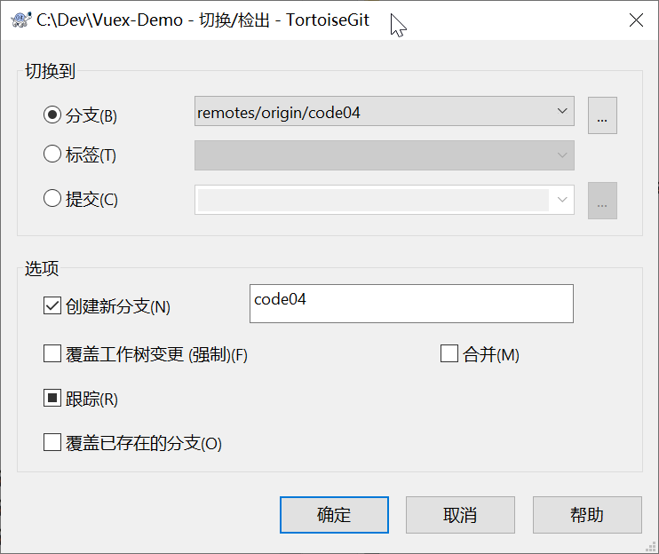
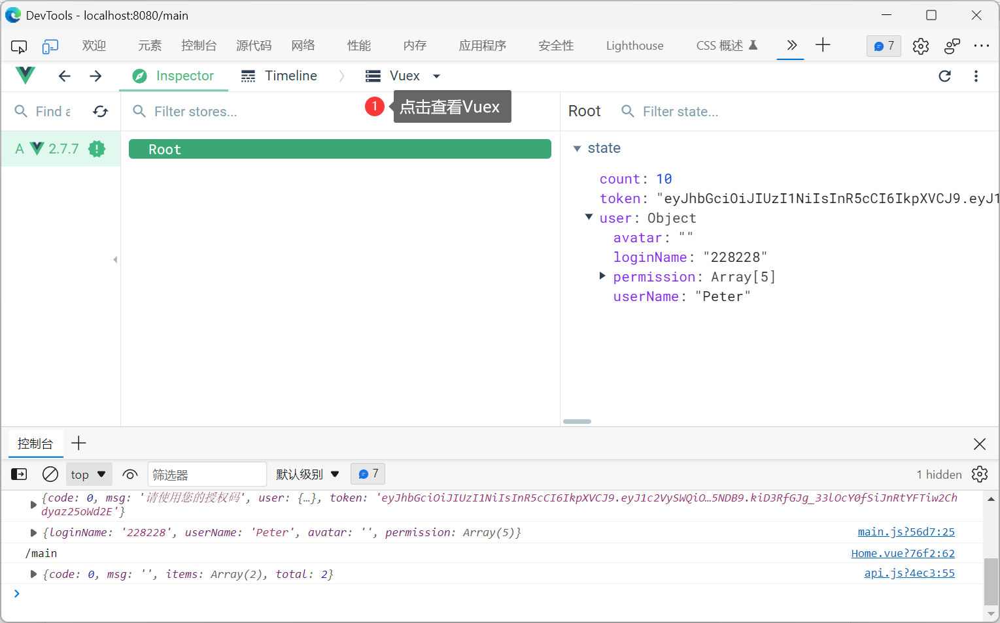
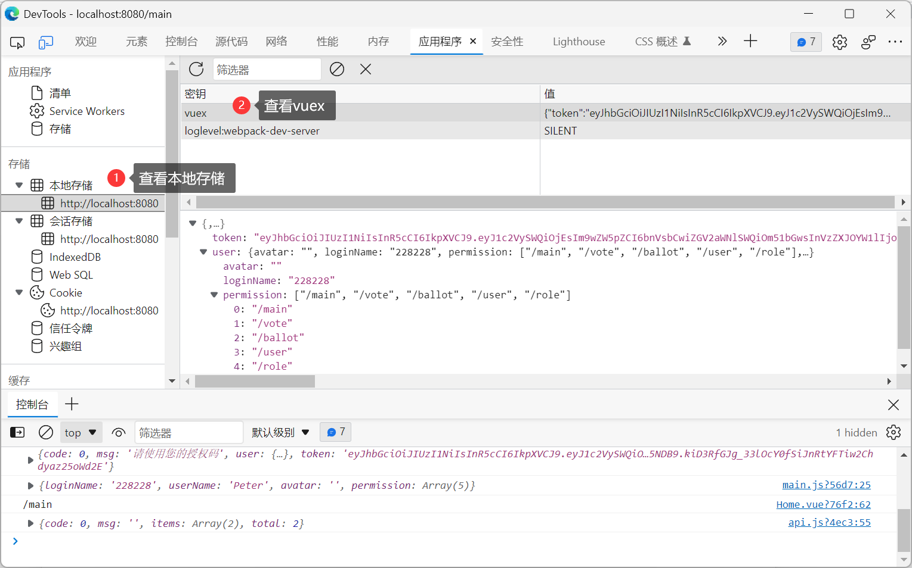

# Vuex

Vuex是一个专门为Vue.js应用程序开发的状态管理模式，它采用集中式存储管理所有组件的公共状态，并以相应的规则保证状态以一种可预测的方式发生变化。

这个状态我们可以理解为在data中的属性，需要共享给其他组件使用的部分。

也就是说，是我们需要共享的data，使用vuex进行统一集中式的管理。


上图中绿色虚线包裹起来的部分就是Vuex的核心，`state`中保存的就是公共状态，改变`state`的唯一方式就是通过`mutations`进行更改。

**vuex中，有默认的五种基本的对象：**

- ==state==：存储状态（变量）
- ==getters==：对数据获取之前的再次编译，可以理解为state的计算属性。我们在组件中使用 `$sotre.getters.fun()`
- ==mutations==：修改状态，并且是同步的。在组件中使用`$store.commit('',params)`。这个和我们组件中的自定义事件类似
- ==actions==：异步操作。在组件中使用是`$store.dispath('')`
- ==modules==：store的子模块，为了开发大型项目，方便状态管理而使用的。这里我们就不解释了，用起来和上面的一样。

## 为什么要使用Vuex

试想这样的场景，比如一个Vue的根实例西面有一个根组件名为`App.vue`，它下面有两个子组件`A.vue`和`B.vue`，`App.vue`想要与`A.vue`或者`B.vue`通讯可以通过props传值的方式，但是如果`A.vue`和`B.vue`之间的通讯就很麻烦了，他们需要共有的父组件通过__自定义事件__进行实现，A组件想要和B组件通讯往往是这样的: 

- A组件说：“报告老大，能否帮我托个信给小弟B” => dispatch一个事件给App
- App老大说：“包在我身上，它需要监听A组件的dispatch的时间，同时需要broadcast一个事件给B组件”
- B小弟说：“信息已收到”，它需要on监听App组件分发的事件

这只是一条通讯路径，如果父组件下有多个子组件，子组件之间通讯的路径就会变的很繁琐，父组件需要监听大量的事件，还需要负责分发给不同的子组件，很显然这并不是我们想要的组件化的开发体验.

> **Vuex就是为了解决这一问题出现的**

## 如何引入Vuex

1. 下载`vuex`: `npm install vuex --save`
2. 在`main.js`添加:

```javascript
import Vuex from 'vuex'

Vue.use( Vuex );

const store = new Vuex.Store({
    //待添加
})

new Vue({
    el: '#app',
    store,
    render: h => h(App)
})
```

## Vuex的核心概念

在介绍Vuex的核心概念之前，我使用`vue-cli`初始化了一个demo，准备以代码的形式来说明Vuex的核心概念，大家可以在github上的[master分支](https://github.com/Lee-Tanghui/Vuex-Demo)进行下载.这个demo分别有两个组件`ProductListOne.vue`和`ProductListTwo.vue`，在`App.vue`的`datat`中保存着共有的商品列表，代码和初始化的效果如下图所示: 

App.vue中的初始化代码

```html
//App.vue中的初始化代码

<template>
<div id="app">
    <product-list-one v-bind:products="products"></product-list-one>
    <product-list-two v-bind:products="products"></product-list-two>
</div>
</template>

<script>
import ProductListOne from './components/ProductListOne.vue'
import ProductListTwo from './components/ProductListTwo.vue'

export default {
    name: 'app',
    components: {
        'product-list-one': ProductListOne,
        'product-list-two': ProductListTwo
    },
    data () {
        return {
            products: [
                {name: '鼠标'，price: 20},
                {name: '键盘'，price: 40},
                {name: '耳机'，price: 60},
                {name: '显示屏'，price: 80}
            ]
        }
    }
}
</script>

<style>
body{
    font-family: Ubuntu;
    color: #555;
}
</style>
```

ProductListOne.vue

```html
//ProductListOne.vue
<template>
    <div id="product-list-one">
        <h2>Product List One</h2>
        <ul>
            <li v-for="product in products">
                <span class="name">{{ product.name }}</span>
                <span class="price">${{ product.price }}</span>
            </li>
        </ul>
    </div>
</template>

<script>
export default {
    props: ['products'],
    data () {
        return {

        }
    }
}
</script>

<style scoped>
#product-list-one{
    background: #FFF8B1;
    box-shadow: 1px 2px 3px rgba(0,0,0,0.2);
    margin-bottom: 30px;
    padding: 10px 20px;
}
#product-list-one ul{
    padding: 0;
}
#product-list-one li{
    display: inline-block;
    margin-right: 10px;
    margin-top: 10px;
    padding: 20px;
    background: rgba(255,255,255,0.7);
}
.price{
    font-weight: bold;
    color: #E8800C;
}
</style>
```

ProductListTwo.vue

```html
//ProductListTwo.vue
<template>
    <div id="product-list-two">
        <h2>Product List Two</h2>
        <ul>
            <li v-for="product in products">
                <span class="name">{{ product.name }}</span>
                <span class="price">${{ product.price }}</span>
            </li>
        </ul>
    </div>
</template>

<script>
export default {
    props: ['products'],
    data () {
        return {
            
        }
    }
}
</script>

<style scoped>
#product-list-two{
    background: #D1E4FF;
    box-shadow: 1px 2px 3px rgba(0,0,0,0.2);
    margin-bottom: 30px;
    padding: 10px 20px;
}
#product-list-two ul{
    padding: 0;
    list-style-type: none;
}
#product-list-two li{
    margin-right: 10px;
    margin-top: 10px;
    padding: 20px;
    background: rgba(255,255,255,0.7);
}
.price{
    font-weight: bold;
    color: #860CE8;
    display: block;
}
</style>
```

### 核心概念1: State

`state`就是Vuex中的公共的状态，我是将`state`看作是所有组件的`data`，用于保存所有组件的公共数据.

- 此时我们就可以把`App.vue`中的两个组件共同使用的data抽离出来，放到`state`中,代码如下:

```javascript
//main.js
import Vue from 'vue'
import App from './App.vue'
import Vuex from 'vuex'

Vue.use( Vuex )

const store = new Vuex.Store({
  state:{ 
    products: [
      {name: '鼠标'，price: 20},
      {name: '键盘'，price: 40},
      {name: '耳机'，price: 60},
      {name: '显示屏'，price: 80}
    ]
  }
})

new Vue({
  el: '#app',
  store,
  render: h => h(App)
})
```

- 此时`ProductListOne.vue`和`ProductListTwo.vue`也需要做相应的更改

```javascript
//ProductListOne.vue
export default {
    data () {
        return {
            products : this.$store.state.products //获取store中state的数据
        }
    }
}
//ProductListTwo.vue
export default {
    data () {
        return {
            products: this.$store.state.products //获取store中state的数据
        }
    }
}
```

- 此时的页面如下图所示，可以看到，将公共数据抽离出来后，页面没有发生变化. 



> 到此处的Github仓库中代码为: [分支code01](https://github.com/Lee-Tanghui/Vuex-Demo/tree/code01)

### 核心概念2: Getters

我将`getters`属性理解为所有组件的`computed`属性，也就是计算属性. vuex的官方文档也是说到可以将getter理解为store的计算属性，getters的返回值会根据它的依赖被缓存起来，且只有当它的依赖值发生了改变才会被重新计算。

- 此时,我们可以在`main.js`中添加一个`getters`属性，其中的`saleProducts`对象将`state`中的价格减少一半(除以2)

```javascript
//main.js
const store = new Vuex.Store({
  state:{
    products: [
      {name: '鼠标'，price: 20},
      {name: '键盘'，price: 40},
      {name: '耳机'，price: 60},
      {name: '显示屏'，price: 80}
    ]
  },
  getters:{ //添加getters
    saleProducts: (state) => {
      let saleProducts = state.products.map( product => {
        return {
          name: product.name,
          price: product.price / 2
        }
      })
      return saleProducts;
    }
  } 
})
```

- 将`productListOne.vue`中的`products`的值更换为`this.$store.getters.saleProducts`

```javascript
export default {
    data () {
        return {
            products : this.$store.getters.saleProducts 
        }
    }
}
```

- 现在的页面中,Product List One中的每项商品的价格都减少了一半



> 到此处的Github仓库中代码为: [分支code02](https://github.com/Lee-Tanghui/Vuex-Demo/tree/code02)

### 核心概念3: Mutations

我将`mutaions`理解为`store`中的`methods`，`mutations`对象中保存着更改数据的回调函数，该函数名官方规定叫`type`，第一个参数是`state`，第二参数是`payload`，也就会自定义的参数.

- 下面,我们在`main.js`中添加`mutations`属性,其中`minusPrice`这个回调函数用于将商品的价格减少`payload`这么多，代码如下:

```javascript
//main.js
const store = new Vuex.Store({
  state:{
    products: [
      {name: '鼠标'，price: 20},
      {name: '键盘'，price: 40},
      {name: '耳机'，price: 60},
      {name: '显示屏'，price: 80}
    ]
  },
  getters:{
    saleProducts: (state) => {
      let saleProducts = state.products.map( product => {
        return {
          name: product.name,
          price: product.price / 2
        }
      })
      return saleProducts;
    }
  },
  mutations:{ //添加mutations
    minusPrice (state, payload) {
      let newPrice = state.products.forEach( product => {
        product.price -= payload
      })
    }
  }
})
```

- 在`ProductListTwo.vue`中添加一个按钮，为其添加一个点击事件，给点击事件触发`minusPrice`方法

```html
<!--ProductListTwo.vue-->
<template>
    <div id="product-list-two">
        <h2>Product List Two</h2>
        <ul>
            <li v-for="product in products">
                <span class="name">{{ product.name }}</span>
                <span class="price">${{ product.price }}</span>
            </li>
            <button @click="minusPrice">减少价格</button> //添加按钮
        </ul>
    </div>
</template>
```

- 在`ProductListTwo.vue`中注册`minusPrice`方法，在该方法中commit`mutations`中的`minusPrice`这个回调函数 **注意:调用mutaions中回调函数，只能使用store.commit(type，payload)**

```javascript
//ProductListTwo.vue
export default {
    data () {
        return {
            products: this.$store.state.products
        }
    },
    methods: {
        minusPrice() {
            this.$store.commit('minusPrice', 2);
        }
    }
}
```

- 添加按钮，可以发现，Product List Two中的价格减少了2，当然你可以自定义`payload`,以此自定义减少对应的价格.



> 到此处的Github仓库中代码为: [分支code03](https://github.com/Lee-Tanghui/Vuex-Demo/tree/code03)

### 核心概念4: Actions

`actions` 类似于 `mutations`，不同在于：

- `actions`提交的是`mutations`而不是直接变更状态
- `actions`中可以包含异步操作，`mutations`中绝对不允许出现异步
- `actions`中的回调函数的第一个参数是`context`，是一个与`store`实例具有相同属性和方法的对象
- 此时,我们在`store`中添加`actions`属性，其中`minusPriceAsync`采用`setTimeout`来模拟异步操作,延迟2s执行 该方法用于异步改变我们刚才在`mutaions`中定义的`minusPrice`

```javascript
//main.js
const store = new Vuex.Store({
  state:{
    products: [
      {name: '鼠标', price: 20},
      {name: '键盘', price: 40},
      {name: '耳机', price: 60},
      {name: '显示屏', price: 80}
    ]
  },
  getters:{
    saleProducts: (state) => {
      let saleProducts = state.products.map( product => {
        return {
          name: product.name,
          price: product.price / 2
        }
      })
      return saleProducts;
    }
  },
  mutations:{
    minusPrice (state, payload ) {
      let newPrice = state.products.forEach( product => {
        product.price -= payload
      })
    }
  },
  actions:{
    minusPriceAsync( context, payload ) {
      setTimeout( () => {
        context.commit( 'minusPrice', payload );
      }, 2000)
    }
  }
})
```

- 在`ProductListTwo.vue`中添加一个按钮,为其添加一个点击事件，给点击事件触发`minusPriceAsync`方法

```html
<template>
    <div id="product-list-two">
        <h2>Product List Two</h2>
        <ul>
            <li v-for="product in products">
                <span class="name">{{ product.name }}</span>
                <span class="price">${{ product.price }}</span>
            </li>
            <button @click="minusPrice">减少价格</button>
            <button @click="minusPriceAsync">异步减少价格</button> //添加按钮
        </ul>
    </div>
</template>
```

- 在`ProductListTwo.vue`中注册`minusPriceAsync`方法，在该方法中dispatch`actions`中的`minusPriceAsync`这个回调函数

```javascript
export default {
    data () {
        return {
            products: this.$store.state.products
        }
    },
    methods: {
        minusPrice() {
            this.$store.commit('minusPrice', 2);
        },
        minusPriceAsync() {
            this.$store.dispatch('minusPriceAsync', 5); //分发actions中的minusPriceAsync这个异步函数
        }
    }
}
```

- 添加按钮，可以发现，Product List Two中的价格延迟2s后减少了5 



> 到此处的Github仓库中代码为: [分支code04](https://github.com/Lee-Tanghui/Vuex-Demo/tree/code04)

### 核心概念5: Modules

> 由于使用单一状态树，应用的所有状态会集中到一个比较大的对象。当应用变得非常复杂时，store 对象就有可能变得相当臃肿。为了解决以上问题，Vuex 允许我们将 store 分割成模块（module）。每个模块拥有自己的 state、mutation、action、getter、甚至是嵌套子模块——从上至下进行同样方式的分割

```javascript
const moduleA = {
  state: { ... },
  mutations: { ... },
  actions: { ... },
  getters: { ... }
}

const moduleB = {
  state: { ... },
  mutations: { ... },
  actions: { ... }
}

const store = new Vuex.Store({
  modules: {
    a: moduleA,
    b: moduleB
  }
})

store.state.a // -> moduleA 的状态
store.state.b // -> moduleB 的状态
```

## 运行案例

```sh
git clone https://github.com/Lee-Tanghui/Vuex-Demo.git
cd Vuex-Demo
npm i
# 列出全部分支
git branch -a
# 把远程分支code04拉到本地
git fetch origin code04
# 在本地创建分支code04并切换到该分支
git checkout -b code04 origin/code04
npm run dev
```



## 版权申明

[Lee-Tanghui/Vuex-Demo (github.com)](https://github.com/Lee-Tanghui/Vuex-Demo)

## 项目示例

这里用Vuex存储令牌和用户信息

**src\vuex\store.js**

```javascript
import Vue from 'vue'
import Vuex from 'vuex'
import * as actions from './actions'
import * as getters from './getters'

Vue.use(Vuex)

// 应用初始状态
const state = {
  count: 10,
  token: '',
  user: {
    avatar: '',
    loginName: '',
    permission: [],
    userName: ''
  }
}

// 定义所需的 mutations
const mutations = {
  INCREMENT(state) {
    state.count++
  },
  DECREMENT(state) {
    state.count--
  },
  setUserInfo(state, payload) {
    Object.assign(state.user, payload)
  },
  setToken(state, payload) {
    state.token = payload
  }
}

// 创建 store 实例
export default new Vuex.Store({
  actions,
  getters,
  state,
  mutations
})
```

**src\vuex\getters.js**—— 仅供预留扩展

```javascript
export const getCount = state => {
  return state.count
}
```

**src\vuex\actions.js** —— 仅供预留扩展

```javascript
export const increment = ({ commit }) => {
  commit('INCREMENT')
}
export const decrement = ({ commit }) => {
  commit('DECREMENT')
}
```

**src\main.js**

```javascript
import Vue from 'vue'
import App from './App'
import Vuex from 'vuex'
import store from './vuex/store'
Vue.use(Vuex)
new Vue({
  store,
  render: h => h(App)
}).$mount('#app')
```

**src\views\Login.vue**的`handleSubmit`函数

```javascript
sessionStorage.setItem('user', JSON.stringify(data.user))
sessionStorage.setItem('token', data.token)
// 追加保存到vuex
this.$store.commit('setUserInfo', data.user)
this.$store.commit('setToken', data.token)
```

**src\api\api.js**

```javascript
import store from '../vuex/store'
// const token = sessionStorage.getItem('token')
// 替换成从vuex中获取
const token = store.state.token
```



> 当然由于vuex在内存里面，一刷新就丢失了，但是可以使用vuex-persistedstate进行持久化保持，不过这还不如直接使用`sessionStorage`或者`localStorage`

```sh
npm i vuex-persistedstate
```

**src\vuex\store.js**中加入vuex-persistedstate

```javascript
import Vue from 'vue'
import Vuex from 'vuex'
import createPersistedState from 'vuex-persistedstate'
import * as actions from './actions'
import * as getters from './getters'

Vue.use(Vuex)

// 应用初始状态
const state = {
  count: 10,
  token: '',
  user: {
    avatar: '',
    loginName: '',
    permission: [],
    userName: ''
  }
}

// 定义所需的 mutations
const mutations = {
  INCREMENT(state) {
    state.count++
  },
  DECREMENT(state) {
    state.count--
  },
  setUserInfo(state, payload) {
    Object.assign(state.user, payload)
  },
  setToken(state, payload) {
    state.token = payload
  }
}

// 创建 store 实例
export default new Vuex.Store({
  plugins: [
    createPersistedState({
      reducer(val) {
        return {
          // 只持久化储存state中的token、user
          token: val.token,
          user: val.user
        }
      }
    })
  ],
  actions,
  getters,
  state,
  mutations
})
```

发现vuex-persistedstate就是用localStorage进行存储的



## Vuex 3 和 4 的主要区别

> Vuex 4 本身可以理解为对 Vue 3 Composition API 的适配，其核心概念并没有发生变化。Vuex 4 依然保持了 Vuex 3 的核心概念。
>
> * State: 应用级别的集中式状态管理。
> * Mutations: 修改状态的唯一方式，必须是同步的。
> * Actions: 用于处理异步操作，并提交 mutations 来更新状态。
> * Getters: 从状态派生出计算属性

### Vue 2

* **Vuex 版本:**  Vuex 3.x
* **安装:** `npm install vuex@3`
* **使用:**

```javascript
// src/store/index.js
import Vue from 'vue'
import Vuex from 'vuex'

Vue.use(Vuex)

export default new Vuex.Store({
  state: {
    count: 0
  },
  mutations: {
    increment(state) {
      state.count++
    }
  },
  actions: {
    incrementAsync({ commit }) {
      setTimeout(() => {
        commit('increment')
      }, 1000)
    }
  }
})

// 在组件中使用
this.$store.state.count
this.$store.commit('increment')
this.$store.dispatch('incrementAsync')
```

### Vue 3

* **Vuex 版本:** Vuex 4.x
* **安装:** `npm install vuex@4`
* **使用:**

```javascript
// src/store/index.js
import { createStore } from 'vuex'

export default createStore({
  state: {
    count: 0
  },
  mutations: {
    increment(state) {
      state.count++
    }
  },
  actions: {
    incrementAsync({ commit }) {
      setTimeout(() => {
        commit('increment')
      }, 1000)
    }
  }
})

// 在组件中使用
import { useStore } from 'vuex'

const store = useStore()

store.state.count
store.commit('increment')
store.dispatch('incrementAsync')
```

### 主要区别

1. **安装和引入方式:** Vuex 4 使用 `createStore` 函数创建 store 实例，并使用 `useStore` 函数在组件中获取 store 实例。
2. **与 Vue 3 的兼容性:** Vuex 4 专为 Vue 3 设计，并利用了 Vue 3 的 Composition API。
3. **响应式改进:** Vuex 4 使用 Vue 3 的 reactivity system，提供更细粒度的响应式更新。
4. **TypeScript 支持:** Vuex 4 提供更好的 TypeScript 支持。

**其他注意事项:**

* Vuex 4 可以与 Vue 2 一起使用，但需要一些额外的配置。
* 对于新的 Vue 3 项目，建议使用 Vuex 4。
* 如果你正在使用 Vuex 3，可以参考官方迁移指南升级到 Vuex 4。


总的来说，Vuex 4 是 Vuex 的一个重要更新，它更好地与 Vue 3 集成，并提供了一些改进和新功能。 
