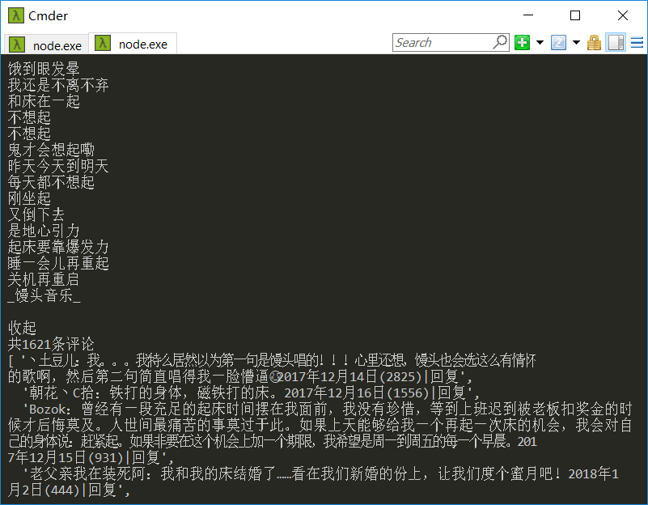
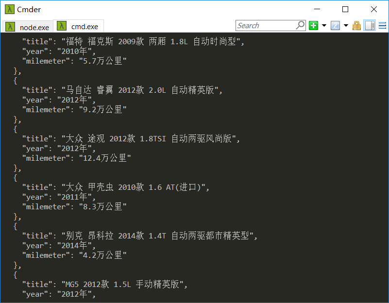
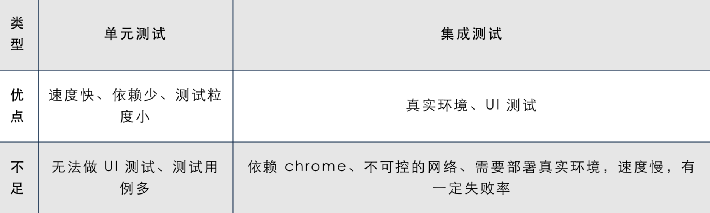
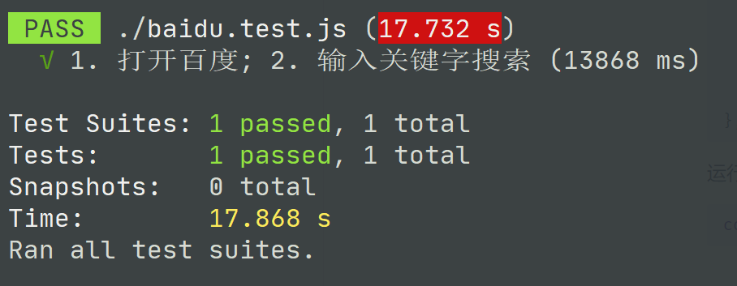
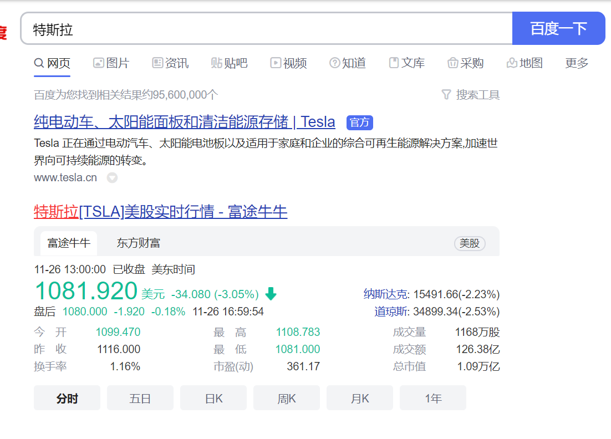
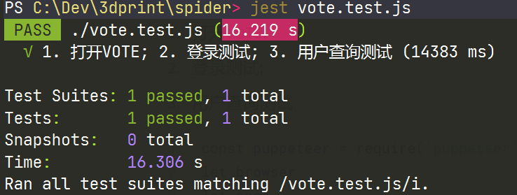
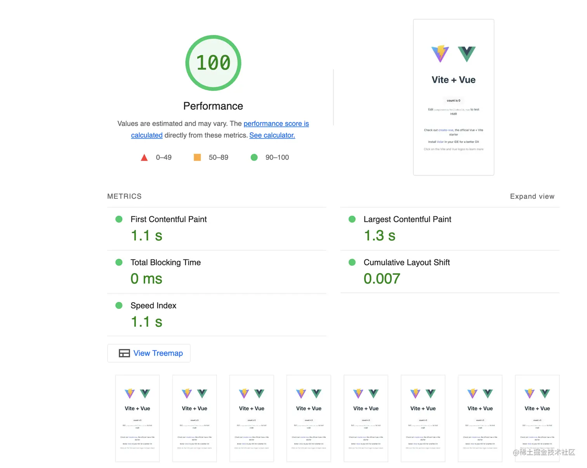

# Puppeteer

 `Puppeteer`  翻译是操纵木偶的人，利用这个工具，我们能做一个操纵页面的人。`Puppeteer`是一个`Nodejs`的库，支持调用`Chrome的API来操纵Web`，相比较`Selenium`或是`PhantomJs`,它最大的特点就是它的操作`Dom`可以完全在内存中进行模拟既在`V8`引擎中处理而不打开浏览器，而且关键是这个是Chrome团队在维护，会拥有更好的兼容性和前景。

## Puppeteer用处

- 利用网页生成PDF、图片
- 爬取SPA应用，并生成预渲染内容（即“SSR” 服务端渲染）
- 可以从网站抓取内容
- 自动化表单提交、UI测试、键盘输入等
- 帮你创建一个最新的自动化测试环境（chrome），可以直接在此运行测试用例
- 捕获站点的时间线，以便追踪你的网站，帮助分析网站性能问题

## 竞品

* Selenium又称Selenium WebDriver，它利用的原理是：使用浏览器原生的WebDriver实现页面操作。Selenium WebDriver是典型的Server-Client模式，Server端就是Remote Server。

* phantomjs 是 一个基于 webkit 内核的无头浏览器，没有 UI 界面。它就是一个浏览器，只是内部的点击、翻页等人为相关操作需要程序设计实现。提供了 javascript API 接口，可以通过 js 直接与 webkit 内核交互，提供了 windows、linux、mac 等不同 OS 的安装使用包。

* Puppeteer(中文翻译”木偶”) 是 Google Chrome 团队官方的无界面（Headless）Chrome 工具，它是一个 Node 库，提供了一个高级的 API 来控制 DevTools协议上的无头版 Chrome 。也可以配置为使用完整的 Chrome。

|                    | **phantomjs**                                                | **puppeteer**                                                |
| ------------------ | ------------------------------------------------------------ | ------------------------------------------------------------ |
| **作者**           | PhantomJS contributors                                       | google                                                       |
| **更新进程**       | 停止更新（V2.1）                                             | 持续更新（V1.8）                                             |
| **安装部署**       | Windows：无需安装，开箱即用<br />Linux：依赖GLIBCXX_3.4.9和GLIBC_2.7 | Windows：依赖node环境，npm install安装，需翻墙<br />Linux：依赖node环境，npm install安装，需翻墙 |
| **部署难度**       | 简单                                                         | 简单，如果不能翻墙则麻烦点                                   |
| **JavaScript标准** | ES5                                                          | ES5，部分支持ES6、ES7(箭头函数,async,await等)                |
| **对Flash支持**    | 不支持                                                       | 未知                                                         |
| **截图功能对比**   | 支持长图截取，特定dom截取<br />长图有高度限制， 超过一定高度后超出部分截图失败 | 完美覆盖phantomjs优点<br />支持等待页面加载<br /> 更自由的截图方式 |
| **优点**           | 部署快捷方便，基本上达到了开箱即用<br />脚本语言更适合原生开发，学习成本低 | 持续更新，功能性能可期<br />支持脚本执行全程可视化（弹出浏览器），调试友好<br />支持chrome插件<br />使用新ES标准，对异步事件处理更简便 |
| **缺点**           | 由于puppeteer的出现，已停止更新<br />对于页面异步的事件处理无力，部分情况下只能用延迟解决<br />开放的api较少<br />只能通过cmd和shell调用 | 脚本语言使用新标准，学习成本较高<br />java端调用仍需使用cmd和shell调用，node端可直接使用 |

## Puppeteer 使用

### 安装Puppeteer

- 由于封网，直接下载 `Chromium` 会失败，可以先阻止下载 `Chromium` 然后再手动下载它

```bash
# 安装命令
npm i puppeteer --save

# 错误信息
ERROR: Failed to download Chromium r515411! Set "PUPPETEER_SKIP_CHROMIUM_DOWNLOAD" env variable to skip download.

# 设置环境变量跳过下载 Chromium
set PUPPETEER_SKIP_CHROMIUM_DOWNLOAD=1 

# 或者可以这样干，只下载模块而不build
npm i --save puppeteer --ignore-scripts

# 成功安装模块
+ puppeteer@0.13.0
added 1 package in 1.77s
```

-  [手动下载 Chromium](https://download-chromium.appspot.com/)，下载完后将压缩包解压，会有个 `Chromium.app`，将其放在你喜欢的目录下，例如 `/Users/huqiyang/Documents/project/z/chromium/Chromium.app`。正常安装包后 `Chromium.app` 会在 `.local-chromium`中

 **Tip：下载 Chromium 失败解决办法**

 - 更换国内`Chromium`源

 ```bash
 PUPPETEER_DOWNLOAD_HOST=https://storage.googleapis.com.cnpmjs.org
 npm i puppeteer
 ```

 - 或者用 `cnpm` 安装

 ```bash
 npm install -g cnpm --registry=https://registry.npm.taobao.org
 cnpm i puppeteer
 ```

[点击查阅 `Puppeteer`  API ](https://github.com/GoogleChrome/puppeteer/blob/master/docs/api.md#pageclickselector-options)

### 初试Puppeteer

**知识点**

-  `puppeteer.launch` 启动浏览器实例
-  `browser.newPage()`  创建一个新页面
-  `page.goto` 进入指定网页
-  `page.screenshot` 截图

```javascript
// puppeteer已经全局安装，需设置环境变量名NODE_PATH指向全局的node_modules
const puppeteer = require("puppeteer");

(async () => {
	const browser = await puppeteer.launch({
		// 若是手动下载的chromium需要指定chromium地址, 默认引用地址为 /项目目录/node_modules/puppeteer/.local-chromium/
		executablePath: "c:/Users/lgc653/AppData/Roaming/npm/node_modules/puppeteer/.local-chromium/win64-588429/chrome-win32/chrome.exe",
		// 设置超时时间
		timeout: 15000,
		// 如果是访问https页面 此属性会忽略https错误
		ignoreHTTPSErrors: true,
		// 打开开发者工具, 当此值为true时, headless总为false
		devtools: false,
		// 关闭headless模式, 不会打开浏览器
		headless: false
	});
	const page = await browser.newPage();
	await page.goto("http://www.baidu.com");
	await page.screenshot({
		path: "baidu.png",
		type: "png",
		// quality: 100, 只对jpg有效
		fullPage: true
		// 指定区域截图，clip和fullPage两者只能设置一个
		// clip: {
		//   x: 0,
		//   y: 0,
		//   width: 1000,
		//   height: 40
		// }
	});
	browser.close();
})();
```

**运行结果**


### Puppeteer进阶

 网易云音乐的API经过AES和RSA算法加密，需要携带加密的信息通过POST方式请求才能获取到数据。但 `Puppeteer` 出现后，这些都不重要了，只要它页面上显示了，通过 `Puppeteer` 都能获取到该元素。

**知识点**

-  `page.type` 获取输入框焦点并输入文字
-  `page.keyboard.press` 模拟键盘按下某个按键，目前mac上组合键无效为已知bug
-  `page.waitFor` 页面等待，可以是时间、某个元素、某个函数
-  `page.frames()` 获取当前页面所有的 `iframe`，然后根据 `iframe` 的名字精确获取某个想要的 `iframe` 
-  `iframe.$('.srchsongst')` 获取 `iframe` 中的某个元素
-  `iframe.evaluate()` 在浏览器中执行函数，相当于在控制台中执行函数，返回一个 `Promise` 
-  `Array.from` 将类数组对象转化为对象
-  `page.click()` 点击一个元素
-  `iframe.$eval()` 相当于在 `iframe` 中运行 `document.queryselector` 获取指定元素，并将其作为第一个参数传递
-  `iframe.$$eval` 相当于在 `iframe` 中运行 `document.querySelectorAll` 获取指定元素数组，并将其作为第一个参数传递

```javascript
const fs = require('fs');
const puppeteer = require('puppeteer');

(async () => {
  const browser = await puppeteer.launch({ headless: false });
  const page = await browser.newPage();
  // 进入页面
  await page.goto('https://music.163.com/#');

  // 点击搜索框拟人输入 鬼才会想起
  const musicName = '鬼才会想';
  await page.type('.txt.j-flag', musicName, {delay: 0});

  // 回车
  await page.keyboard.press('Enter');

  // 获取歌曲列表的 iframe
  await page.waitFor(2000);
  let iframe = await page.frames().find(f => f.name() === 'contentFrame');
  const SONG_LS_SELECTOR = await iframe.$('.srchsongst');

  // 获取歌曲 鬼才会想起 的地址
  const selectedSongHref = await iframe.evaluate(e => {
    const songList = Array.from(e.childNodes);
    const idx = songList.findIndex(v => v.childNodes[1].innerText.replace(/\s/g, '') === '鬼才会想起');
    return songList[idx].childNodes[1].firstChild.firstChild.firstChild.href;
  }, SONG_LS_SELECTOR);

  // 进入歌曲页面
  await page.goto(selectedSongHref);

  // 获取歌曲页面嵌套的 iframe
  await page.waitFor(2000);
  iframe = await page.frames().find(f => f.name() === 'contentFrame');

  // 点击 展开按钮
  const unfoldButton = await iframe.$('#flag_ctrl');
  await unfoldButton.click();

  // 获取歌词
  const LYRIC_SELECTOR = await iframe.$('#lyric-content');
  const lyricCtn = await iframe.evaluate(e => {
    return e.innerText;
  }, LYRIC_SELECTOR);

  console.log(lyricCtn);

  // 截图
  await page.screenshot({
    path: '歌曲.png',
    fullPage: true,
  });

  // 写入文件
  let writerStream = fs.createWriteStream('歌词.txt');
  writerStream.write(lyricCtn, 'UTF8');
  writerStream.end();

  // 获取评论数量
  const commentCount = await iframe.$eval('.sub.s-fc3', e => e.innerText);
  console.log(commentCount);

  // 获取评论
  const commentList = await iframe.$$eval('.itm', elements => {
    const ctn = elements.map(v => {
      return v.innerText.replace(/\s/g, '');
    });
    return ctn;
  });
  console.log(commentList);
})();
```

**运行结果**



### 高级爬虫

 爬取SPA应用，并生成预渲染内容（即“SSR” 服务端渲染），通俗讲就是在页面上显示的内容我们都能获取到。下面我们就通过爬取 `瓜子二手车直卖网` 的车辆信息来认识它。

**首先通过 axios 来试试**

```javascript
const axios = require('axios');
const useAxios = () => {
  axios.get('https://www.guazi.com/hz/buy/')
    .then(((result) => {
      console.log(result.data);
    }))
    .catch((err) => {
      console.log(err);
    });
};
```

结果啥都没有返回

**通过 Puppeteer 爬取**

```javascript
const fs = require("fs");
const puppeteer = require("puppeteer");

(async () => {
  const browser = await puppeteer.launch({ headless: false });
  const page = await browser.newPage();

  // 进入页面
  await page.goto("https://www.guazi.com/hz/buy/", { waitUntil: "domcontentloaded" });
  // 一般加了domcontentloaded会有效，但是guazi做了延迟加载，那就再等2秒
  await page.waitFor(2000);

  // 获取页面标题
  let title = await page.title();
  console.log(title);

  // 获取汽车品牌
  const BRANDS_INFO_SELECTOR = ".dd-all.clearfix.js-brand.js-option-hid-info";
  const brands = await page.evaluate(sel => {
    const ulList = Array.from($(sel).find("ul li p a"));
    const ctn = ulList.map(v => {
      return v.innerText.replace(/\s/g, "");
    });
    return ctn;
  }, BRANDS_INFO_SELECTOR);
  console.log("汽车品牌: ", JSON.stringify(brands));
  let writerStream = fs.createWriteStream("car_brands.json");
  writerStream.write(JSON.stringify(brands, undefined, 2), "UTF8");
  writerStream.end();
  // await bodyHandle.dispose();

  // 获取车源列表
  const CAR_LIST_SELECTOR = "ul.carlist";
  const carList = await page.evaluate(sel => {
    const catBoxs = Array.from($(sel).find("li a"));
    const ctn = catBoxs.map(v => {
      const title = $(v)
        .find("h2.t")
        .text();
      const subTitle = $(v)
        .find("div.t-i")
        .text()
        .split("|");
      return {
        title: title,
        year: subTitle[0],
        milemeter: subTitle[1]
      };
    });
    return ctn;
  }, CAR_LIST_SELECTOR);

  console.log(`总共${carList.length}辆汽车数据: `, JSON.stringify(carList, undefined, 2));

  // 将车辆信息写入文件
  writerStream = fs.createWriteStream("car_info_list.json");
  writerStream.write(JSON.stringify(carList, undefined, 2), "UTF8");
  writerStream.end();

  browser.close();
})();
```

**运行结果**



``` json
[
  {
    "title": "路虎 揽胜极光 2015款 2.0T 五门风尚版",
    "year": "2016年",
    "milemeter": "4.8万公里"
  },
  {
    "title": "别克 凯越 2013款 1.5L 手动经典型",
    "year": "2013年",
    "milemeter": "14.3万公里"
  },
  {
    "title": "路虎 发现神行 2017款 2.0T HSE",
    "year": "2017年",
    "milemeter": "4.8万公里"
  },
  {
    "title": "奥迪A4L 2011款 2.0 TFSI 标准型",
    "year": "2011年",
    "milemeter": "9.9万公里"
  },
  {
    "title": "大众 帕萨特 2015款 1.8TSI DSG御尊版",
    "year": "2015年",
    "milemeter": "5.6万公里"
  },
  {
    "title": "捷豹XF 2015款 XF 2.0T 风华版",
    "year": "2015年",
    "milemeter": "9.2万公里"
  },
  {
    "title": "宝马3系 2009款 318i 领先型",
    "year": "2009年",
    "milemeter": "13.1万公里"
  },
  {
    "title": "奔腾B70 2010款 2.0L 自动时尚型",
    "year": "2010年",
    "milemeter": "9.7万公里"
  },
  {
    "title": "奥迪Q5 2013款 40 TFSI 舒适型",
    "year": "2013年",
    "milemeter": "3.3万公里"
  },
  {
    "title": "英菲尼迪Q50 2014款 2.0T 豪华运动版(进口)",
    "year": "2014年",
    "milemeter": "5.3万公里"
  },
  {
    "title": "宝马3系 2013款 328i M运动型(进口)",
    "year": "2013年",
    "milemeter": "7.0万公里"
  },
  {
    "title": "众泰 大迈X5 2015款 1.5T CVT地主型 国V",
    "year": "2016年",
    "milemeter": "14.8万公里"
  },
  {
    "title": "大众CC 2013款 2.0TSI 至尊型",
    "year": "2013年",
    "milemeter": "9.7万公里"
  },
  {
    "title": "东风风神A60 2016款 1.5L 自动豪华型",
    "year": "2016年",
    "milemeter": "15.7万公里"
  },
  {
    "title": "凯迪拉克ATS-L 2016款 28T 时尚型",
    "year": "2016年",
    "milemeter": "7.9万公里"
  },
  {
    "title": "英菲尼迪QX50 2015款 2.5L 舒适版",
    "year": "2016年",
    "milemeter": "2.3万公里"
  },
  {
    "title": "福特 金牛座 2015款 EcoBoost 325 V6旗舰型",
    "year": "2018年",
    "milemeter": "1.0万公里"
  },
  {
    "title": "现代 瑞纳 2014款 1.4L 自动智能型GLS",
    "year": "2015年",
    "milemeter": "8.9万公里"
  },
  {
    "title": "奔驰GLA级 2016款 GLA 200 时尚型",
    "year": "2016年",
    "milemeter": "2.6万公里"
  },
  {
    "title": "沃尔沃XC60 2010款 T6 AWD智雅版(进口)",
    "year": "2009年",
    "milemeter": "9.5万公里"
  },
  {
    "title": "福特 福克斯 2013款 三厢经典 1.8L 手动基本型",
    "year": "2014年",
    "milemeter": "7.8万公里"
  },
  {
    "title": "别克 英朗 2012款 GT 1.6L 自动时尚版",
    "year": "2011年",
    "milemeter": "9.0万公里"
  },
  {
    "title": "三菱 翼神 2011款 时尚版 1.8L CVT舒适型",
    "year": "2011年",
    "milemeter": "9.9万公里"
  },
  {
    "title": "Jeep 指南者 2012款 2.4L 四驱都市版(进口)",
    "year": "2012年",
    "milemeter": "5.9万公里"
  },
  {
    "title": "MINI Clubman 2012款 1.6T COOPER S Fun",
    "year": "2013年",
    "milemeter": "4.4万公里"
  },
  {
    "title": "五菱宏光 2015款 1.5L S基本型 国IV",
    "year": "2015年",
    "milemeter": "5.0万公里"
  },
  {
    "title": "东南 V5菱致 2012款 1.5L 手动舒适型",
    "year": "2013年",
    "milemeter": "3.2万公里"
  },
  {
    "title": "奥迪A6L 2012款 TFSI 标准型",
    "year": "2013年",
    "milemeter": "14.6万公里"
  },
  {
    "title": "本田 锋范 2015款 1.5L CVT舒适版",
    "year": "2016年",
    "milemeter": "3.6万公里"
  },
  {
    "title": "奔驰C级 2010款 C 260 CGI 运动型",
    "year": "2010年",
    "milemeter": "6.7万公里"
  },
  {
    "title": "宝马3系 2010款 320i豪华型(进口)",
    "year": "2010年",
    "milemeter": "8.9万公里"
  },
  {
    "title": "宝马2系旅行车(进口) 2015款 218i 领先型(进口)",
    "year": "2015年",
    "milemeter": "5.5万公里"
  },
  {
    "title": "比亚迪 思锐 2013款 1.5TID 自动尊贵型",
    "year": "2013年",
    "milemeter": "6.5万公里"
  },
  {
    "title": "奥迪Q3 2013款 40 TFSI quattro 豪华型",
    "year": "2013年",
    "milemeter": "5.7万公里"
  },
  {
    "title": "福特 福克斯 2009款 两厢 1.8L 自动时尚型",
    "year": "2010年",
    "milemeter": "5.7万公里"
  },
  {
    "title": "马自达 睿翼 2012款 2.0L 自动精英版",
    "year": "2012年",
    "milemeter": "9.2万公里"
  },
  {
    "title": "大众 途观 2012款 1.8TSI 自动两驱风尚版",
    "year": "2012年",
    "milemeter": "12.4万公里"
  },
  {
    "title": "大众 甲壳虫 2010款 1.6 AT(进口)",
    "year": "2011年",
    "milemeter": "8.3万公里"
  },
  {
    "title": "别克 昂科拉 2014款 1.4T 自动两驱都市精英型",
    "year": "2014年",
    "milemeter": "4.2万公里"
  },
  {
    "title": "MG5 2012款 1.5L 手动精英版",
    "year": "2012年",
    "milemeter": "5.3万公里"
  }
]
```

### 文章版权

链接：https://www.jianshu.com/p/a9a55c03f768

## 案例

```sh
cd c:\Dev\3dprint\spider\
node baidu_screenshot.js
node music_163_lyric.js
node article_ofweek.js
node article_3ddayin.js https://www.3ddayin.net/xinwenpindao/guowaikuaidi/40531.html
```

## Jest + Puppeteer 界面自动化测试

用puppeteer做集成测试，测试用例是真正在真实的浏览器上执行的，下面几点都是它所擅长的

- 生成页面屏幕截图或pdf
- 自动提交表单，做UI测试、模拟键盘输入、鼠标操作等
- 创建一个最新的自动化测试环境，用最新的JavaScript和浏览器功能，直接在最新的chrome中做测试
- 捕获你网站的时间线跟踪，以帮助诊断性能问题



### 案例特斯拉

* 在百度中搜索“特斯拉”
* 判断搜索结果中至少5条必须和关键字相关
* 截图留存

```javascript
const puppeteer = require('puppeteer')
let browser
let page
let screen = {
    width: 1920,
    height: 1080
}

beforeAll(async () => {
    browser = await puppeteer.launch({
        args: ['--start-maximized'], //浏览器窗口最大化
        headless: false, //开启或关闭无头模式
        ignoreHTTPSErrors: true,
        slowMo: 250, //slow down by 250ms, 减慢运行的速度，更好的看清楚操作
        timeout: 15000,
        ignoreHTTPSErrors: true, //若访问的是https页面，则忽略https错误
        devtools: false //打开或关闭浏览器的开发者模式
    })
    page = await browser.newPage()
    page.setViewport({
        width: screen.width,
        height: screen.height //当前屏幕的长和宽
    })
    await page.setJavaScriptEnabled(true)
})

afterAll(async () => {
    await browser.close()
})

test('1. 打开百度; 2. 输入关键字搜索', async () => {
    //声明是异步函数
    await page.goto('https://www.baidu.com', {
        waitUntil: 'networkidle2' //等待网络状态为空闲的时候才继续执行
    })

    //添加assertion，验证百度的标题是否正确
    const pageTitle = await page.title()
    await expect(pageTitle).toMatch('百度一下，你就知道')

    await page.focus('#kw')
    await page.type('#kw', '特斯拉')
    await page.click('#su')
    await page.waitForSelector('h3.t a')
    const list = await page.$$eval('h3.t a', elements => {
        const ctn = elements.map(v => {
            return v.innerText.replace(/\s/g, '')
        })
        return ctn
    })
    console.log(list)
    let matchCount = 0
    for (var i = 0; i < list.length; i++) {
        if (list[i].indexOf('特斯拉') !== -1 || list[i].indexOf('Tesla') !== -1) {
            matchCount++
        }
    }
    // 检索结果中至少有5条和关键字匹配
    await expect(matchCount).toBeGreaterThanOrEqual(5)
    // 截图留存
    await page.screenshot({
        path: 'baidu-tesla.png',
        type: 'png',
        fullPage: true
    })
}, 60000) //设置timeout时间为60000 ms
```

运行

```sh
cd c:\Dev\3dprint\spider && c: && jest baidu.test.js
```





```sh
  console.log
    [
      '纯电动车、太阳能面板和清洁能源存储|Tesla',
      '官方',
      '特斯拉[TSLA]美股实时行情-富途牛牛',
      '保时捷首款纯电动跑车Taycan-现已到店-电驰神往',
      '特斯拉-视频大全-高清在线观看',
      '在武汉市搜索特斯拉-百度地图',
      '11月28日,厦门英菲尼迪QX60特卖',
      '特斯拉的最新相关信息',
      '特斯拉吧-百度贴吧',
      '马斯克尝到甜头,斥资12亿在上海扩产,中国市场成特斯拉的大...',
      '特斯拉租车上58同城,-新用户日租仅需69元',
      '',
      '高合HiPhiX-百公里加速3.9秒,首付1.5成起',
      '',
      '2022款[CS75PLUS]焕新而来!',
      ''
    ]

      at Object.<anonymous> (baidu.test.js:51:13)
```

### 案例VOTE

自动化测试VOTE案例

1. 打开VOTE; 
2. 登录测试; 
3. 用户查询测试

打开VOTE

```sh
nvm use 12.22.12
wnmp_start
cd c:\Dev\archives\vote\service\ && npm run start
cd c:\Dev\archives\vote\admin\ && npm run dev
```

测试代码

```javascript
const puppeteer = require('puppeteer')
let browser
let page
let screen = {
  width: 1920,
  height: 1080
}

beforeAll(async () => {
  browser = await puppeteer.launch({
    args: ['--start-maximized'], //浏览器窗口最大化
    headless: false, //开启或关闭无头模式
    ignoreHTTPSErrors: true,
    slowMo: 50, //slow down by 50ms, 减慢运行的速度，更好的看清楚操作
    timeout: 15000,
    ignoreHTTPSErrors: true, //若访问的是https页面，则忽略https错误
    devtools: false //打开或关闭浏览器的开发者模式
  })
  page = await browser.newPage()
  page.setViewport({
    width: screen.width,
    height: screen.height //当前屏幕的长和宽
  })
  await page.setJavaScriptEnabled(true)
})

afterAll(async () => {
  await browser.close()
})

test('1. 打开VOTE; 2. 登录测试; 3. 用户查询测试', async () => {
  //声明是异步函数
  await page.goto('http://localhost:8080/#/login', {
    waitUntil: 'networkidle2' //等待网络状态为空闲的时候才继续执行
  })

  // 添加assertion，验证标题是否正确
  const pageTitle = await page.title()
  await expect(pageTitle).toMatch('视频投票')
  // 输入用户名
  const usernameInput = await page.waitForSelector('input[type="text"]')
  await usernameInput.click()
  await usernameInput.type('228228')
  // 输入错误的密码
  const passwordInput = await page.waitForSelector('input[type="password"]')
  await passwordInput.click()
  await passwordInput.type('errorpassword')
  // 点击'登陆'按钮
  const loginBtn = await page.waitForSelector('button')
  await loginBtn.click()
  // 判断是否弹出错误的提示框
  await page.waitForSelector('p.el-message__content')
  // 等待提示框出现
  const errInfo = await page.$eval('p.el-message__content', el => el.innerText)
  // 判断提示框内容
  await expect(errInfo).toMatch('用户密码错误')
  // 修改为正确的密码并重新登录
  await page.$eval('input[type="password"]', el => (el.value = '')) //清空现有密码
  await passwordInput.click()
  await passwordInput.type('225225225')
  await loginBtn.click()
  // 判断是否成功登录
  await page.waitForSelector('.userinfo-inner')
  const userinfo = await page.$eval('.userinfo-inner', el => el.innerText)
  await expect(userinfo).toMatch('228228')
  // 点击用户菜单
  const menuSys = await page.waitForXPath('//div[@class="el-submenu__title"][contains (text(),"管理面板")]')
  menuSys.click()
  const menuUser = await page.waitForXPath('//li[@class="el-menu-item"][contains (text(),"用户")]')
  menuUser.click()
  // 在搜索框中搜索Peter
  const searchUser = await page.waitForXPath('//div[contains (@class,"toolbar")]/form//input[@placeholder="姓名"]')
  await searchUser.type('Peter')
  const searchBtn = await page.waitForXPath('//div[contains (@class,"toolbar")]/form//button')
  searchBtn.click()
  // 等待网络查询后遍历表格
  await page.waitFor(2000)
  const list = await page.$$eval('tr td.el-table_1_column_3', elements => {
    const ctn = elements.map(v => {
      return v.innerText.replace(/\s/g, '')
    })
    return ctn
  })
  // 判断是不是每个查询结果都包含Peter
  let matchCount = 0
  for (var i = 0; i < list.length; i++) {
    if (list[i].indexOf('Peter') !== -1) {
      matchCount++
    }
  }
  await expect(matchCount).toEqual(list.length)
  // 截图留存
  await page.screenshot({
    path: 'vote.png',
    type: 'png',
    fullPage: true
  })
}, 60000) //设置timeout时间为60000 ms
```

运行

```sh
cd c:\Dev\3dprint\spider && c: && jest vote.test.js
```



## puppeteer的前端性能测试

一个项目需要获取一系列的性能指标：

* 建连时间 
* ssl握手时长 
* 首包时间 
* 首屏时间
* 下载时长
* 下载总时间
* 下载速率  

需要模拟一系列的测试场景：需要对比1k,10k,100k,1m,10m,100m需要对比视频流播放，需要对比文件下载，需要对比多路重传

### 手工测试方案

使用chrome的dev tool查看记录数据，可以详细参考[网络分析参考 - Microsoft Edge Development | Microsoft Docs](https://docs.microsoft.com/zh-cn/microsoft-edge/devtools-guide-chromium/network/reference)

### 自动解决方案


#### window.performance.timing API

使用puppeteer+window.performance.timing API，在上例最后加入

```javascript
const performanceTiming = JSON.parse(
	await page.evaluate(() => JSON.stringify(window.performance.timing))
);
console.log(performanceTiming);
```

得到结果

```json
{                                             
    navigationStart: 1638084141112,             
    unloadEventStart: 1638084141164,            
    unloadEventEnd: 1638084141165,              
    redirectStart: 0,                           
    redirectEnd: 0,                             
    fetchStart: 1638084141114,                  
    domainLookupStart: 1638084141114,           
    domainLookupEnd: 1638084141114,             
    connectStart: 1638084141114,                
    connectEnd: 1638084141114,                  
    secureConnectionStart: 0,                   
    requestStart: 1638084141115,                
    responseStart: 1638084141161,               
    responseEnd: 1638084141898,                 
    domLoading: 1638084141167,                  
    domInteractive: 1638084142618,              
    domContentLoadedEventStart: 1638084142642,  
    domContentLoadedEventEnd: 1638084142650,    
    domComplete: 1638084144104,                 
    loadEventStart: 1638084144104,              
    loadEventEnd: 1638084144105                 
}                                               
```

具体说明可以参考[PerformanceTiming - Web API 接口参考 | MDN (mozilla.org)](https://developer.mozilla.org/zh-CN/docs/Web/API/PerformanceTiming)

常见的计算公式

* DNS查询耗时 = domainLookupEnd - domainLookupStart
* TCP链接耗时 = connectEnd - connectStart
* request请求耗时 = responseEnd - responseStart
* 解析dom树耗时 = domComplete - domInteractive
* 白屏时间 = domloadng - fetchStart
* domready时间 = domContentLoadedEventEnd - fetchStart

* onload时间 = loadEventEnd - fetchStart 

案例：获取白屏时间、整屏时间

```javascript
const dataHandle = (timeData) => {
  let result = {}
  result.holeTime = timeData.loadEventEnd - timeData.domainLookupStart //整屏时间
  result.domTime = timeData.domContentLoadedEventStart - timeData.domainLookupStart //白屏时间
  return result
}

module.exports = dataHandle
```

* **白屏时间**

  指浏览器开始显示内容的时间。但是在传统的采集方式里，是在HTML的head标签结尾里记录时间戳，来计算白屏时间。在这个时刻，浏览器开始解析body标签内的内容。而现代浏览器不会等待CSS树（所有CSS文件下载和解析完成）和DOM树（整个body标签解析完成）构建完成才开始绘制，而是马上开始显示中间结果。所以经常在低网速的环境中，观察到页面由上至下缓慢显示完，或者先显示文本内容后再重绘成带有格式的页面内容。

* **整页时间**

  整页时间（Page Load Time），是指页面完成整个加载过程的时刻。从Navigation Timing API上采集，就是loadEventEnd减去navigationStart。在传统采集方法中，会使用window对象的onload事件来记录时间戳，它表示浏览器认定该页面已经载入完全了。

#### tracing api

如果想了解每个资源文件的加载情况，使用tracing api获取详细性能指标

```javascript
// 开始测试前start tracing
await page.tracing.start({ path: 'multi.json' })
// 测试代码
// 结束时关闭
await page.tracing.stop()
```

解析保存的multi.json生成报表即可

> 根据requestId匹配ResourceSendRequest和ResourceReceiveResponse

```json
{
  "traceEvents": [
    {
      "name": "ResourceSendRequest",
      "cat": "devtools.timeline",
      "ph": "I",
      "ts": 100214169786,
      "pid": 17972,
      "tid": 7648,
      "args": {
        "data": {
          "requestId": "1000017972.145",
          "frame": "095AE222195429C0C28348A3F4A1A35A",
          "url": "https://example.com/image1.jpg",
          "requestMethod": "GET",
          "priority": "Low"
        }
      }
    },
    {
      "name": "ResourceReceiveResponse",
      "cat": "devtools.timeline",
      "ph": "I",
      "ts": 100214170200,
      "pid": 17972,
      "tid": 7648,
      "args": {
        "data": {
          "requestId": "1000017972.145",
          "frame": "095AE222195429C0C28348A3F4A1A35A",
          "url": "https://example.com/image1.jpg",
          "status": 200,
          "responseHeaders": {
            "content-type": "image/jpeg"
          }
        }
      }
    },
    {
      "name": "ResourceSendRequest",
      "cat": "devtools.timeline",
      "ph": "I",
      "ts": 100214171000,
      "pid": 17972,
      "tid": 7648,
      "args": {
        "data": {
          "requestId": "1000017972.146",
          "frame": "095AE222195429C0C28348A3F4A1A35A",
          "url": "https://example.com/image2.jpg",
          "requestMethod": "GET",
          "priority": "Low"
        }
      }
    },
    {
      "name": "ResourceReceiveResponse",
      "cat": "devtools.timeline",
      "ph": "I",
      "ts": 100214172500,
      "pid": 17972,
      "tid": 7648,
      "args": {
        "data": {
          "requestId": "1000017972.146",
          "frame": "095AE222195429C0C28348A3F4A1A35A",
          "url": "https://example.com/image2.jpg",
          "status": 200,
          "responseHeaders": {
            "content-type": "image/jpeg"
          }
        }
      }
    }
  ]
}
```

#### 移动端模式

puppeteer有自带的包，可以将页面设置为移动端模式再进行操作

```javascript
const devices = require('puppeteer/DeviceDescriptors')
const iPhone = devices['iPhone 6']
```

将变量iPhone作为参数传入page.emulate()方法中即可以移动端模式打开页面。

#### 对网速进行限制

这边我们要用DevTools中的Network对网速进行限制，代码如下

```javascript
await page._client.send('Network.emulateNetworkConditions', {
    offline: false,
    latency: 200, // ms
    downloadThroughput: 780 * 1024 / 8, // 780 kb/s
    uploadThroughput: 330 * 1024 / 8, // 330 kb/s
});
```

### 实例

利用 Puppeteer 的 Tracing API 计算资源的加载时间并找出耗时过长的请求，可以按照以下步骤进行：

#### 步骤 1: 安装 Puppeteer

如果你还没有安装 Puppeteer，可以通过 npm 安装：

```bash
npm install puppeteer
```

#### 步骤 2: 启用 Tracing

使用 Puppeteer 的 tracing 功能来捕获性能数据。以下是一个示例代码，演示如何启动 tracing，加载页面，并分析资源请求的耗时。

```javascript
const puppeteer = require('puppeteer');

(async () => {
    // 启动浏览器
    const browser = await puppeteer.launch();
    const page = await browser.newPage();

    // 启用 tracing
    await page.tracing.start({ path: 'trace.json', screenshots: true });

    // 加载页面
    await page.goto('https://example.com', { waitUntil: 'networkidle2' });

    // 停止 tracing
    await page.tracing.stop();

    // 关闭浏览器
    await browser.close();

    // 读取并分析 trace.json
    const fs = require('fs');
    const traceData = JSON.parse(fs.readFileSync('trace.json', 'utf8'));

    // 提取资源加载时间
    const resources = traceData.traceEvents.filter(event => event.name === 'ResourceSendRequest' || event.name === 'ResourceReceiveResponse');

    const resourceTimes = {};

    resources.forEach(event => {
        const requestId = event.args.data.requestId;
        const timestamp = event.ts;

        if (event.name === 'ResourceSendRequest') {
            resourceTimes[requestId] = { start: timestamp };
        } else if (event.name === 'ResourceReceiveResponse' && resourceTimes[requestId]) {
            resourceTimes[requestId].end = timestamp;
        }
    });

    // 计算耗时并找出耗时过长的请求
    const longRequests = [];

    for (const requestId in resourceTimes) {
        if (resourceTimes[requestId].end && resourceTimes[requestId].start) {
            const duration = resourceTimes[requestId].end - resourceTimes[requestId].start;
            if (duration > 1000) { // 例如，设置阈值为 1000 毫秒
                longRequests.push({ requestId, duration });
            }
        }
    }

    console.log('耗时过长的请求:', longRequests);
})();
```

#### 步骤 3: 分析结果

在上述代码中，我们做了以下几件事情：

1. 启动 Puppeteer 浏览器并打开新页面。
2. 启用 tracing，并指定输出文件 `trace.json`。
3. 加载目标网页，等待网络空闲。
4. 停止 tracing，并关闭浏览器。
5. 读取 `trace.json` 文件，提取资源请求的开始和结束时间。
6. 计算每个请求的耗时，并找出耗时超过 1000 毫秒的请求。

#### 注意事项

- 你可以根据需要调整阈值（例如 1000 毫秒），以便找出不同的慢请求。
- 该示例代码是一个基本的实现，你可以根据实际需求进行扩展和优化。
- 确保在运行代码时，目标网站允许自动化访问，避免触发反爬虫机制。

通过这种方式，你可以有效地使用 Puppeteer 的 Tracing API 来分析网页加载性能，并找出耗时过长的请求。

## puppeteer开发性能守卫

> 性能守卫是一种系统或工具，用于监控和管理应用程序或系统的性能。它旨在确保应用程序在各种负载和使用情况下能够提供稳定和良好的性能。

Lighthouse是一个开源的自动化工具，提供了四种使用方式：

- Chrome DevTools
- Chrome插件
- Node CLI
- Node模块

```js
// 伪代码
const puppeteer = require('puppeteer');
const lighthouse = require('lighthouse');
const {URL} = require('url');

async function run() {
  // 使用 puppeteer 连接到 Chrome 浏览器
  const browser = await puppeteer.launch({
    headless: true,
    args: ['--no-sandbox', '--disable-setuid-sandbox'],
  });

  // 新建一个页面
  const page = await browser.newPage();
  
  // 在这里，你可以执行任何Puppeteer代码，例如:
  // await page.goto('https://example.com');
  // await page.click('button');

  const url = 'https://example.com';

  // 使用 Lighthouse 进行审查
  const {lhr} = await lighthouse(url, {
    port: new URL(browser.wsEndpoint()).port,
    output: 'json',
    logLevel: 'info',
  });

  console.log(`Lighthouse score: ${lhr.categories.performance.score * 100}`);

  await browser.close();
}

run();
```



## 服务端渲染

使用puppeteer可以制作spiderServer，应对搜索引擎

当发现是搜索引擎访问时（通过nginx判断UA），使用puppeteer解析VUE页面，将response输出，实现服务器渲染

```javascript
const puppeteer = require('puppeteer')
const http = require('http')
var server = http.createServer()
server.on('request', async function(request, response) {
  try {
    console.log(`客户端请求：${request.url}`)
    const browser = await puppeteer.launch({
      ignoreHTTPSErrors: true,
      headless: true,
      timeout: 10000,
      args: ['--no-sandbox', '--disable-setuid-sandbox']
    })
    const page = await browser.newPage()
    // 访问
    await page
      .goto(`http://cloud.mohou.com${request.url}`, { waitUntil: 'domcontentloaded' })
      .catch(err => console.log(err))
    if (request.url.startsWith('/public_view/') || request.url.startsWith('/public_cad_view/')) {
      const watchDog = page.waitForFunction('document.title !== "魔猴网 - 3D模型云"')
      await watchDog
    }
    let content = await page.content()
    await browser.close()
    response.write(content)
    response.end()
  } catch (e) {
    console.log(`${request.url} 异常：${e}`)
    response.write('')
    response.end()
  }
})

server.listen(33388, function() {
  console.log('服务器启动成功了，可以通过 http://127.0.0.1:33388/ 来进行访问')
})
```

