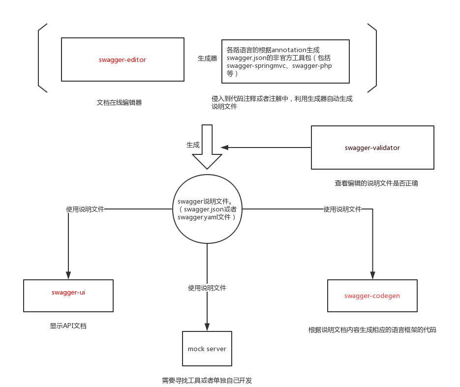
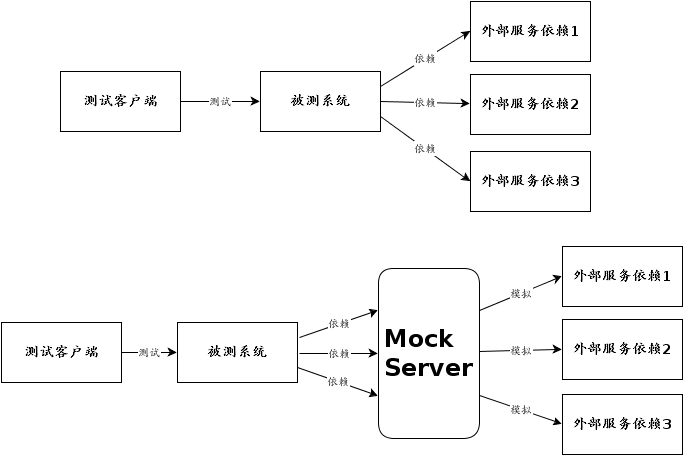
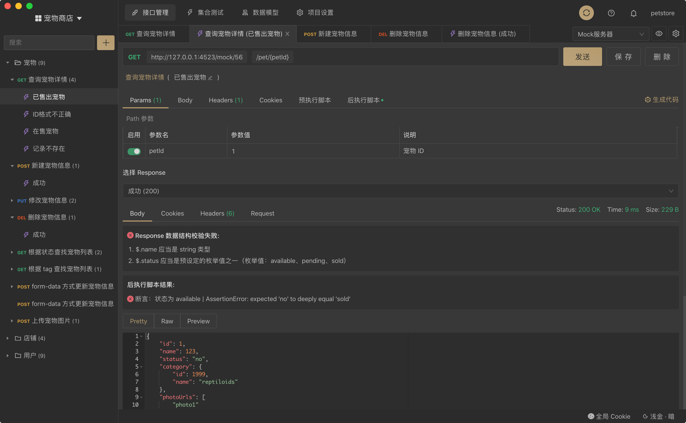
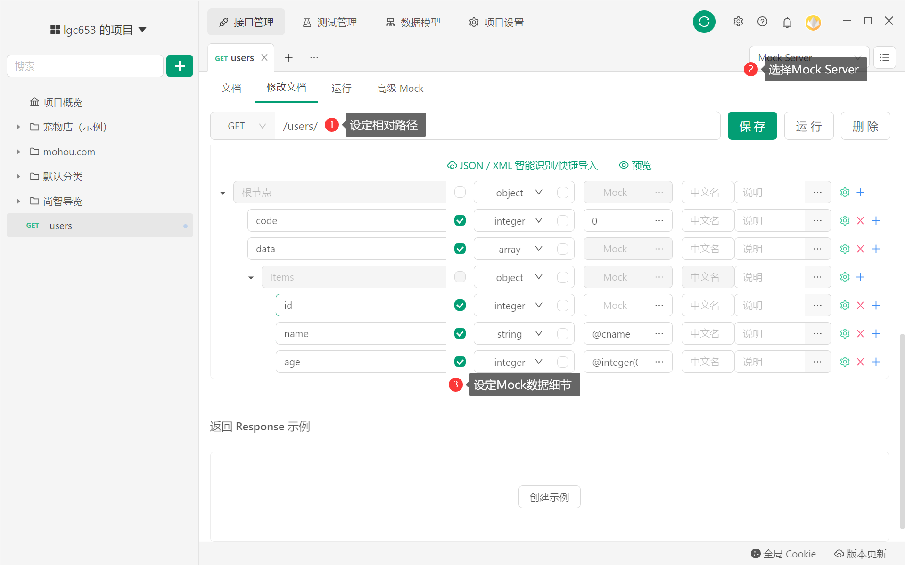
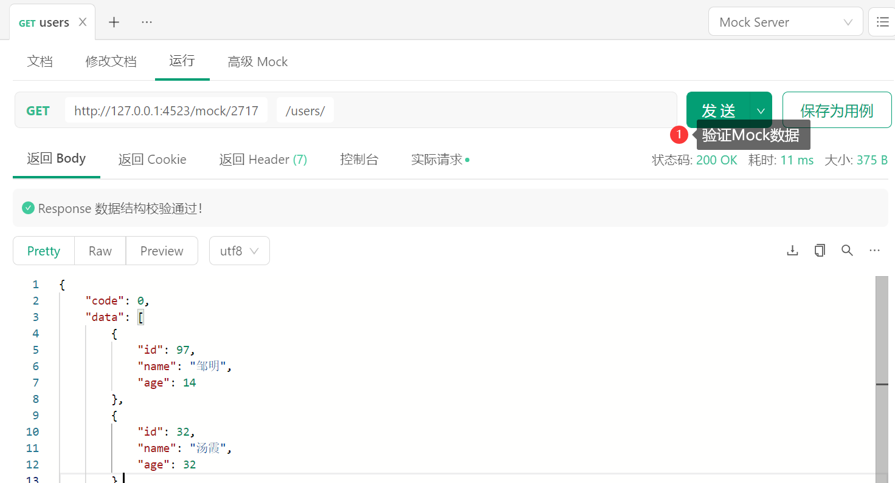
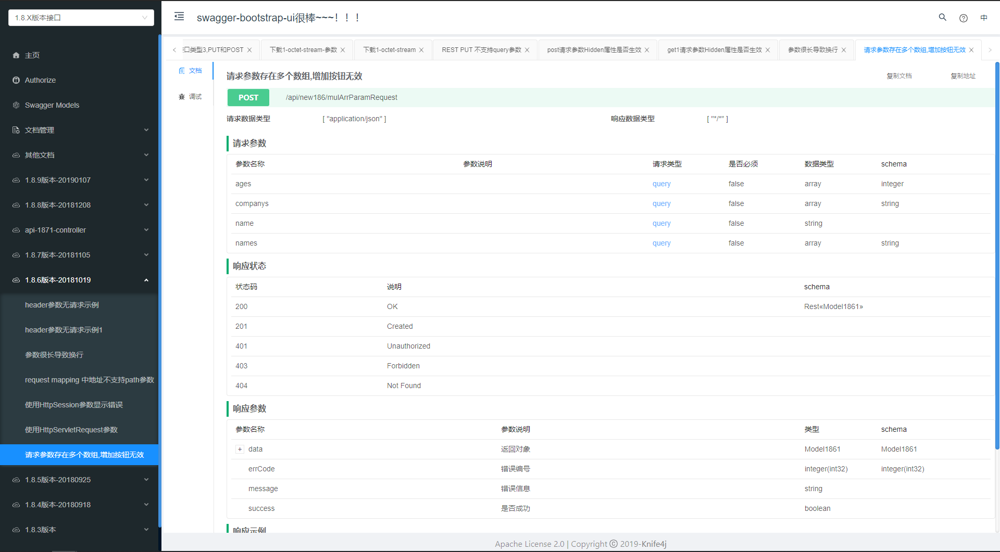
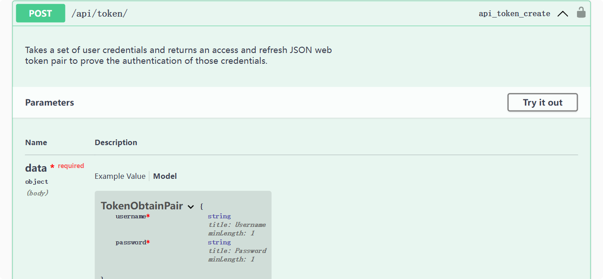
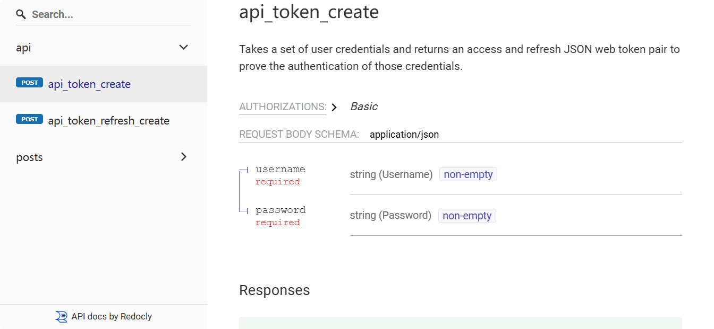

# Swagger

## 关于 Swagger

Swagger能成为最受欢迎的REST APIs文档生成工具之一，有以下几个原因：

- Swagger 可以生成一个具有互动性的API控制台，开发者可以用来快速学习和尝试API。
- Swagger 可以生成客户端SDK代码用于各种不同的平台上的实现。
- Swagger 文件可以在许多不同的平台上从代码注释中自动生成。
- Swagger 有一个强大的社区，里面有许多强悍的贡献者。

Swagger 文档提供了一个方法，使我们可以用指定的 JSON 或者 YAML 摘要来描述你的 API，包括了比如 names、order 等 API 信息。

你可以通过一个文本编辑器来编辑 Swagger 文件，或者你也可以从你的代码注释中自动生成。各种工具都可以使用 Swagger 文件来生成互动的 API 文档。

> 注意：用 Swagger 文件生成互动的 API 文档是最精简的，它展示了资源、参数、请求、响应。但是它不会提供你的API如何工作的其他任何一个细节。

## Petstore 的 Swagger 例子

http://petstore.swagger.io/

### 创建一个 pet

1. 展开 pet 的 post 方法
1. 然后单击 Model Schema 中的黄色字体的 JSON。这里用 JSON 填充了 body value。这里的 JSON 是你必须上传的，用于创建 pet 资源。

1. 将第一个 id 标签的值修改一下（你必须保证 id 值都是唯一的，并且不能从 0 开始）。

1. 将 name 标签的值修改一下（最好也要唯一，方便对比结果），以下是示例代码：

```json
{
	"id": 37987,
	"category": {
		"id": 0,
		"name": "string"
	},
	"name": "Mr. Fluffernutter",
	"photoUrls": ["string"],
	"tags": [
		{
			"id": 0,
			"name": "string"
		}
	],
	"status": "available"
}
```

5、单击 Try it out! 按钮，查看响应Response body：

```xml
<?xml version="1.0" encoding="UTF-8" standalone="yes"?>
  <Pet>
    <category>
      <id>0</id>
      <name>string</name>
    </category>
    <id>37987</id>
    <name>Mr. Fluffernutter</name>
    <photoUrls>
      <photoUrl>string</photoUrl>
    </photoUrls>
    <status>available</status>
    <tags>
      <tag>
        <id>0</id>
        <name>string</name>
      </tag>
    </tags>
  </Pet>
```

### 通过 ID 查询 pet

展开 Get 方法：pet/{petId}，输入你的 petId，单击 Try it out!，你创建的 pet 就会显示在 response 中。
默认情况下，api 响应都是 xml。可以把 Response Content Type 修改为 application/json 再试一次。
返回的值将会是 JSON 格式

例如输入刚才新增的ID：37987，得到如下的响应

```xml
<?xml version="1.0" encoding="UTF-8" standalone="yes"?>
  <Pet>
    <category>
      <id>0</id>
      <name>string</name>
    </category>
    <id>37987</id>
    <name>Mr. Fluffernutter</name>
    <photoUrls>
      <photoUrl>string</photoUrl>
    </photoUrls>
    <status>available</status>
    <tags>
      <tag>
        <id>0</id>
        <name>string</name>
      </tag>
    </tags>
  </Pet>
```

##  Swagger 组件

Swagger 分成一些不同的块。

* ==Swagger spec==：这一块对元素的嵌套、命令等采用官方模式。如果你想要对 Swagger 文件手动编码，你必须非常熟悉 Swagger spec。
* ==Swagger editor==：这是在线编辑器，用于验证你的 YML 格式的内容是否违反 Swagger spec 。YML 是一种句法，依赖于空格和嵌套。你需要对 YML 句法很熟悉才能很好的遵守 Swagger spec 规范。Swagger 编辑器会标出错误并且给你格式提醒（Swagger spec 文件可以使用 JSON 或者 YAML 中的任意一种格式）。
* ==Swagger-UI==：这是一套 HTML/CSS/JS 框架用于解析遵守 Swagger spec 的 JSON 或 YML 文件，并且生成API文档的UI导航。它可以将你的规格文档转换成Swagger Petsotre-like UI。
* ==Swagger-codegen==：这个工具可以为不同的平台生成客户端 SDK（比如 Java、JavaScript、Python 等）。这些客户端代码帮助开发者在一个规范平台中整合 API ，并且提供了更多健壮的实现，可能包含了多尺度、线程，和其他重要的代码。SDK 是用于支持开发者使用 REST API 的工具。



## Swagger实战

```yaml
---
swagger: "2.0"
info:
  description: "沃雷特广告联盟API使用说明"
  version: "1.0.0"
  title: "沃雷特广告联盟API"
  termsOfService: "http://promotion.xywallet.com/"
  contact:
    email: "xue@xywallet.com"
host: "promotion2.xywallet.com"
basePath: "/api"
schemes:
- "http"
paths:
  /getAds/{app_uuid}:
    post:
      summary: "拉取广告"
      description: ""
      operationId: "getAds"
      consumes:
      - "application/x-www-form-urlencoded"
      produces:
      - "application/json"
      parameters:
      - name: "app_uuid"
        in: "path"
        description: "由广告联盟平台生成，直接通过URL提交"
        required: true
        type: "string"
      - name: "client_uuid"
        in: "formData"
        description: "能够标识终端的唯一代码，由用户根据自己规则生成"
        required: true
        type: "string"
      - name: "secret"
        in: "formData"
        description: "由广告联盟平台生成的用户密钥"
        required: true
        type: "string"
      - name: "location"
        in: "formData"
        description: "经度和纬度用英文逗号分割的字符串，例如114.419969 ,30.455953"
        required: false
        type: "string"
      responses:
        400:
          description: "API errors"
          schema:
            type: "object"
            properties:
              flag:
                type: "boolean"
                default: false
                description: "当false时返回message，包含错误代码。"
              message_code:
                type: "string"
                description: "错误代码"
              message:
                type: "string"
                description: "错误提示"          
        200:
          description: "successful operation"
          schema:
            type: "object"
            properties:
              flag:
                type: "boolean"
                default: true
                description: "bool类型，当true时返回token和data，当false时返回message，包含错误代码。"
              token:
                type: "string"
                description: "上报点击、展现时作为参数上报，用于验证数据提交者身份"
              data:
                type: "array"
                items:
                  $ref: '#/definitions/Ad'
        
  /reportShow/{app_uuid}:
    post:
      summary: "上报展现"
      description: ""
      operationId: "reportShow"
      consumes:
      - "application/x-www-form-urlencoded"
      produces:
      - "application/json"
      parameters:
      - name: "app_uuid"
        in: "path"
        description: "由广告联盟平台生成，直接通过URL提交"
        required: true
        type: "string"
      - name: "ad_uuid"
        in: "formData"
        description: "由广告联盟平台生成，通过POST提交"
        required: true
        type: "string"
      - name: "client_uuid"
        in: "formData"
        description: "能够标识终端的唯一代码，由用户根据自己规则生成"
        required: true
        type: "string"
      - name: "token"
        in: "formData"
        description: "由广告联盟平台生成，获取广告时的token字段，此时回报，用于验证数据提交者身份"
        required: true
        type: "string"
      - name: "date"
        in: "formData"
        description: "上报数据的相关日期"
        required: true
        type: "string"
      - name: "hour"
        in: "formData"
        description: "上报数据的相关小时，如果不需要按小时统计数据，一次性上报全天数据，则不填写"
        required: false
        type: "string"
      - name: "amount"
        in: "formData"
        description: "本广告在本推广位，指定机器（client_uuid），指定日期（date），指定小时（hour，可选，不填则代表上报全天数据）所展示的数量"
        required: true
        type: "integer"           
      responses:
        400:
          description: "API errors"
          schema:
            type: "object"
            properties:
              flag:
                type: "boolean"
                default: false
                description: "当false时返回message，包含错误代码。"
              message_code:
                type: "string"
                description: "错误代码"
              message:
                type: "string"
                description: "错误提示"          
        200:
          description: "successful operation"
          schema:
            type: "object"
            properties:
              flag:
                type: "boolean"
                default: true
                description: "bool类型，当true时返回result。"
              result:
                type: "object"
                description: "执行成功的各种信息"
                $ref: '#/definitions/Result'
    
definitions:
  Ad:
    type: "object"
    properties:
      ad_uuid:
        type: "string"
        description: "广告UUID"
      ad_text:
        type: "string"
        description: "广告文字"
      ad_img:
        type: "string"
        description: "广告图片"
      ad_link:
        type: "string"
        description: "广告跳转链接，推广位可以通过各种模式打开此链接，实现广告的跳转和广告点击的上报，如果在非触摸机器上，通过展示素材的二维码等进行交互，则此跳转链接可以制作到二维码中。"
      ad_weight:
        type: "integer"
        description: "广告推荐权重，如上例，一共返回2个广告，权重合计是8+2=10，则第一个广告推荐展示比例是80%，第二个广告推荐展示比例是20%（本参数仅供参考，也可以自定义策略进行展示）"
        default: 1
      ad_interval:
        type: "integer"
        description: "广告推荐轮播时长，以秒为单位。"
      monitor_url:
        type: "string"
        description: "第三方监控地址，由第三方提供。"
  Result:
    type: "object"
    properties:
      id:
        type: "string"
        description: "执行结果集的ID"
      time:
        type: "integer"
        description: "执行结果集的时间"
```

## Mock Server

现今的业务系统很少有孤立存在的，它们或多或少需要使用兄弟团队或是其他公司提供的服务，这给我们的联调和测试造成了麻烦。对于这种情况，我们常见的解决方案是搭建一个临时的server，模拟那些服务，提供数据进行联调和测试。这就是 mock server 出现原因。

下图很好的解释了Mock Server 位置和作用： 



##  Postman

Postman是由Postdot Technologies公司打造的一款功能强大的调试HTTP接口的工具，它最早是Chrome中最受欢迎的插件之一，现已扩展到Mac，[**Windows**](javascript:;)和[**Linux**](javascript:;)客户端。

软件功能非常强大，界面简洁明晰、操作方便快捷，设计得很人性化。

**Postman主要特征**

- 简单易用的图形用户界面；
- 保存API请求的历史记录)；
- 无限制的使用集合、环境变量、运行测试和共享集合；
- 可用集合Runner来自动化测试；
- 灵活的API监控，运行时间、性能和准确；
- 模拟服务器，支持split-stack开发。

导入：https://petstore.swagger.io/v2/swagger.json

Postman测试代码

```javascript
pm.test("Response time is less than 2000ms", function () {
    pm.expect(pm.response.responseTime).to.be.below(2000);
});
pm.test("Response name is Mr. Fluffernutter", function () {
    var jsonObject = xml2Json(responseBody);
    pm.expect(jsonObject.Pet.name).to.eql('Mr. Fluffernutter');
});
pm.test("Status code is 200", function () {
    pm.response.to.have.status(200);
});
```

Pre-request Script

```javascript
const echoPostRequest = {
	url: "http://" + pm.environment.get("domain") + "/mohou/auth/nonweblogin",
	method: "POST",
	header: { "Content-Type": "multipart/form-data" },
	body: {
		mode: "formdata",
		formdata: [
			{ key: "device_type", value: "0" },
			{ key: "mode", value: 0 },
			{ key: "user_name", value: "……" },
			{ key: "password", value: "……" }
		]
	}
};
pm.sendRequest(echoPostRequest, function(err, res) {
	console.log(err ? err : res.json());
	const response = res.json();
	pm.environment.set("mohou_token", response.mohou_token);
});
```

## Apifox

### 接口管理现状

#### 常用解决方案

1. 使用 Swagger 管理接口文档
2. 使用 Postman 调试接口
3. 使用 RAP Mock 数据
4. 使用 JMeter 做接口自动化测试

#### 存在的问题

维护不同工具之间数据一致性非常困难、非常低效。并且这里不仅仅是工作量的问题，更大的问题是多个系统之间数据不一致，导致协作低效，频繁出问题，开发人员痛苦不堪。

### Apifox解决方案

Apifox = Postman + Swagger + Mock + JMeter



#### 可视化接口文档管理

1. 方便快捷可视化的接口文档管理工具，成倍提升团队多人协作效率。
2. 支持数据结构（JSON Schema）管理，多接口可复用相同数据结构。

#### 接口调试

Postman 有的功能，比如环境变量、预执行脚本、后执行脚本、Cookie/Session 全局共享 等功能，Apifox 都有，并且和 Postman 一样高效好用。

#### 自动校验数据结构

接口调试时，自动校验返回的数据结构是否符合接口文档定义，一键发现接口数据异常。

#### 接口数据 Mock

1. 内置 Mock.js 规则引擎，非常方便 mock 出各种数据，并且可以在定义数据结构的同时写好 mock 规则。
2. 支持自定义期望，灵活配置根据参数值返回不同数据内容。
3. 零配置即可 Mock 出非常人性化的数据

通过ApiFox设定Mock数据，方便异步请求测试





模拟异步请示，测试渲染结果是否一致

#### 自动化测试

1. 完善的接口自动化测试功能，保证接口数据的正确性。
2. 支持自定义脚本，自动化检查数据正确性。自定义脚本语法 100% 兼容 Postman，降低学习成本。

#### 数据导入/导出

1. 支持导出 OpenApi (Swagger)、Markdown、Html 等数据格式。
2. 支持导入 OpenApi (Swagger)、Postman、HAR、RAP2、JMeter、YApi、Eolinker、RAML、DOClever、ApiPost 、Apizza 、DOCWAY、ShowDoc、I/O Docs、WADL、Google Discovery 等数据格式。

#### 高效团队协作

接口云端同步，实时更新。成熟的团队/项目权限管理，满足各类企业的需求。

#### 全中文的详细文档

https://www.apifox.cn/help/

## knife4j

Knife4j是为Java MVC框架集成Swagger生成Api文档的增强解决方案,前身是swagger-bootstrap-ui,取名kni4j是希望她能像一把匕首一样小巧,轻量,并且功能强悍!

Knife4j的前身是`swagger-bootstrap-ui`，为了契合微服务的架构发展,由于原来`swagger-bootstrap-ui`采用的是后端Java代码+前端Ui混合打包的方式,在微服务架构下显的很臃肿,因此项目正式更名为`knife4j`

https://gitee.com/xiaoym/knife4j



## Django REST Framework Swagger

**Django REST Framework Swagger** (drf-yasg) 是一个用于为 Django REST Framework API 自动生成交互式 API 文档的工具，基于 OpenAPI 规范 (以前称为 Swagger 规范)。它允许开发者轻松地浏览和测试 API 端点。

以下是 drf-yasg 的使用方法：

**1. 安装:**

```bash
pip install drf-yasg
```

**2. 配置:**

* **添加到 INSTALLED_APPS:**

```python
INSTALLED_APPS = [
    # ...
    'drf_yasg',
    # ...
]
```

* **配置 URL:**

```python
from django.urls import path, include
from rest_framework import permissions
from drf_yasg.views import get_schema_view
from drf_yasg import openapi

schema_view = get_schema_view(
   openapi.Info(
      title="Your API Title",
      default_version='v1',
      description="Your API Description",
      terms_of_service="https://www.google.com/policies/terms/",
      contact=openapi.Contact(email="contact@snippets.local"),
      license=openapi.License(name="BSD License"),
   ),
   public=True,
   permission_classes=[permissions.AllowAny],
)

urlpatterns = [
    # ...
    path('swagger/', schema_view.with_ui('swagger', cache_timeout=0), name='schema-swagger-ui'),
    path('redoc/', schema_view.with_ui('redoc', cache_timeout=0), name='schema-redoc'),
    # ...
]
```

**3.  (可选) 添加文档字符串:**

在你的视图和序列化器中添加详细的文档字符串，drf-yasg 会自动提取这些信息并将其包含在 API 文档中。

例如：

```python
from rest_framework import serializers

class UserSerializer(serializers.ModelSerializer):
    """
    Serializer for User model.
    """
    class Meta:
        model = User
        fields = ('id', 'username', 'email')
```

**4. 访问 Swagger UI:**

启动你的 Django 开发服务器，然后访问 `/swagger/` 或 `/redoc/`  即可查看生成的 API 文档。

**Swagger UI** 提供了一个交互式界面，允许你浏览 API 端点、查看请求和响应示例，并直接在浏览器中测试 API。



**Redoc** 提供了一个更简洁的界面，专注于 API 文档的可读性。



**其他功能:**

* **自定义 schema:** 你可以通过自定义 `get_schema_view` 函数的参数来调整生成的 schema。
* **身份验证:** 你可以配置 Swagger UI 以支持不同的身份验证方法，例如 OAuth 2.0。
* **代码生成:** 你可以使用 Swagger Codegen 工具根据 OpenAPI 规范生成客户端代码。

## gitea.io的api实例

导入：https://try.gitea.io/swagger.v1.json

在线文档：https://try.gitea.io/api/swagger