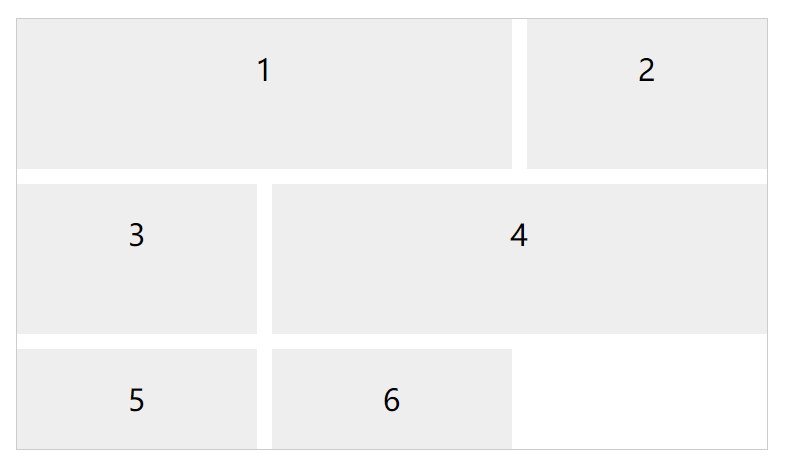
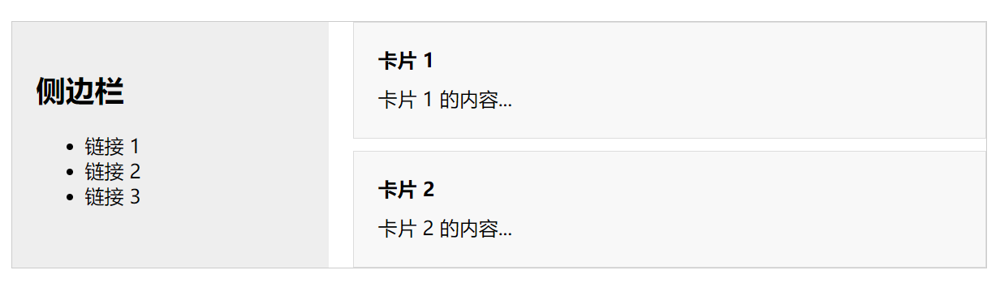

# 前端布局

## Flex布局

Flex 是 Flexible Box 的缩写，意为"弹性布局"，用来为盒状模型提供最大的灵活性。

布局的传统解决方案，基于盒状模型，依赖 `display` 属性 + `position`属性 + `float`属性。它对于那些特殊布局非常不方便，比如，垂直居中就不容易实现。

2009年，W3C 提出了一种新的方案----Flex 布局，可以简便、完整、响应式地实现各种页面布局。目前，它已经得到了所有浏览器的支持，这意味着，现在就能很安全地使用这项功能。


下边按照上图的顺序来详细说明下每个属性的作用，并且参考 **W3C** 提到的代码结构：

```html
<!DOCTYPE html>
<html>
  <head>
    <style>
      /* 父元素 */
      .flex-container {
        display: flex;
        flex-direction: row;
        background-color: DodgerBlue;
      }

      /* 子元素 */
      .flex-container > div {
        background-color: #f1f1f1;
        width: 100px;
        margin: 10px;
        text-align: center;
        line-height: 75px;
        font-size: 30px;
      }
    </style>
  </head>
  <body>
    <div class="flex-container">
      <div>1</div>
      <div>2</div>
      <div>3</div>
    </div>
  </body>
</html>
```

代码总体结构都是上边的样子，下边介绍的时候就省略了。

### 基本概念

采用 Flex 布局的元素，称为 Flex 容器（flex container），简称"**`容器`**"。它的所有子元素自动成为容器成员，称为 Flex 项目（flex item），简称"**`项目`**"。


容器默认存在两根轴：水平的主轴（main axis）和垂直的交叉轴（cross axis）。主轴的开始位置（与边框的交叉点）叫做`main start`，结束位置叫做`main end`；交叉轴的开始位置叫做`cross start`，结束位置叫做`cross end`。

项目默认沿主轴排列。单个项目占据的主轴空间叫做`main size`，占据的交叉轴空间叫做`cross size`。

### 容器的属性

- `flex-direction`
- `flex-wrap`
- `flex-flow`
- `justify-content`
- `align-items`
- `align-content`

#### flex

> ⭐ display: flex;

父元素变为 `flex` 布局，并且为 `block` 块级元素。

```html
<!DOCTYPE html>
<html>
  <head>
    <style>
      .flex-container {
        display: flex;
        background-color: DodgerBlue;
        margin: 10px;
      }

      .flex-container > div {
        background-color: #f1f1f1;
        margin: 10px;
        padding: 20px;
        font-size: 30px;
      }
    </style>
  </head>
  <body>
    <div class="flex-container">
      <div>1</div>
      <div>2</div>
      <div>3</div>
    </div>
    <div class="flex-container">
      <div>4</div>
      <div>5</div>
      <div>6</div>
    </div>
  </body>
</html>
```


> ⭐ display: inline-flex;

父元素变为 `flex` 布局，并且是行内元素。

```html
<!DOCTYPE html>
<html>
  <head>
    <style>
      .flex-container {
        display: inline-flex;
        background-color: DodgerBlue;
        margin: 10px;
      }

      .flex-container > div {
        background-color: #f1f1f1;
        margin: 10px;
        padding: 20px;
        font-size: 30px;
      }
    </style>
  </head>
  <body>
    <div class="flex-container">
      <div>1</div>
      <div>2</div>
      <div>3</div>
    </div>
    <div class="flex-container">
      <div>4</div>
      <div>5</div>
      <div>6</div>
    </div>
  </body>
</html>
```

两个元素会在同一行展示。


#### flex-direction

`flex-direction`属性决定主轴的方向（即项目的排列方向）。

```css
.box {
  flex-direction: row | row-reverse | column | column-reverse;
}
```


它可能有4个值。

> - `row`（默认值）：主轴为水平方向，起点在左端。
> - `row-reverse`：主轴为水平方向，起点在右端。
> - `column`：主轴为垂直方向，起点在上沿。
> - `column-reverse`：主轴为垂直方向，起点在下沿。

> ⭐ display: flex/inline-flex  ➡️ 父元素  ➡️ flex-flow:  ➡️ flex-direction:  ➡️ row

`row` 为默认值

```html
<!DOCTYPE html>
<html>
  <head>
    <style>
      .flex-container {
        display: flex;
        flex-direction: row;
        background-color: DodgerBlue;
      }

      .flex-container > div {
        background-color: #f1f1f1;
        margin: 10px;
        padding: 20px;
        font-size: 30px;
      }
    </style>
  </head>
  <body>
    <div class="flex-container">
      <div>1</div>
      <div>2</div>
      <div>3</div>
    </div>
  </body>
</html>
```

在水平方向从左到右排列，同时决定了主轴为水平方向。


> ⭐ display: flex/inline-flex  ➡️ 父元素  ➡️ flex-flow:  ➡️ flex-direction:  ➡️ row-reverse

```html
<!DOCTYPE html>
<html>
  <head>
    <style>
      .flex-container {
        display: flex;
        flex-direction: row-reverse;
        background-color: DodgerBlue;
      }

      .flex-container > div {
        background-color: #f1f1f1;
        margin: 10px;
        padding: 20px;
        font-size: 30px;
      }
    </style>
  </head>
  <body>
    <div class="flex-container">
      <div>1</div>
      <div>2</div>
      <div>3</div>
    </div>
  </body>
</html>
```

在水平方向从右到左排列，同时决定了主轴为水平方向。


> ⭐ display: flex/inline-flex  ➡️ 父元素  ➡️ flex-flow:  ➡️ flex-direction:  ➡️ column

```html
<!DOCTYPE html>
<html>
  <head>
    <style>
      .flex-container {
        display: flex;
        flex-direction: column;
        background-color: DodgerBlue;
      }

      .flex-container > div {
        background-color: #f1f1f1;
        margin: 10px;
        padding: 20px;
        font-size: 30px;
      }
    </style>
  </head>
  <body>
    <div class="flex-container">
      <div>1</div>
      <div>2</div>
      <div>3</div>
    </div>
  </body>
</html>
```

在垂直方向从上到下排列，同时决定了主轴为垂直方向。


> ⭐ display: flex/inline-flex  ➡️ 父元素  ➡️ flex-flow:  ➡️ flex-direction:  ➡️ column-reverse

```html
<!DOCTYPE html>
<html>
  <head>
    <style>
      .flex-container {
        display: flex;
        flex-direction: column-reverse;
        background-color: DodgerBlue;
      }

      .flex-container > div {
        background-color: #f1f1f1;
        margin: 10px;
        padding: 20px;
        font-size: 30px;
      }
    </style>
  </head>
  <body>
    <div class="flex-container">
      <div>1</div>
      <div>2</div>
      <div>3</div>
    </div>
  </body>
</html>
```

在垂直方向从下到上排列，同时决定了主轴为垂直方向。


*下边为了简明，各属性都是默认主轴为水平方向进行举例*

#### flex-wrap

默认情况下，项目都排在一条线（又称"轴线"）上。`flex-wrap`属性定义，如果一条轴线排不下，如何换行。


```css
.box{
  flex-wrap: nowrap | wrap | wrap-reverse;
}
```

它可能取三个值。

（1）`nowrap`（默认）：不换行。


（2）`wrap`：换行，第一行在上方。


（3）`wrap-reverse`：换行，第一行在下方。


> ⭐ display: flex/inline-flex  ➡️ 父元素  ➡️ flex-flow:  ➡️flex-wrap:  ➡️ wrap

```html
<!DOCTYPE html>
<html>
  <head>
    <style>
      .flex-container {
        display: flex;
        flex-wrap: wrap;
        background-color: DodgerBlue;
      }

      .flex-container > div {
        background-color: #f1f1f1;
        margin: 10px;
        padding: 20px;
        font-size: 30px;
      }
    </style>
  </head>
  <body>
    <div class="flex-container">
      <div>1</div>
      <div>2</div>
      <div>3</div>
      <div>4</div>
      <div>5</div>
      <div>6</div>
      <div>7</div>
      <div>8</div>
      <div>9</div>
      <div>10</div>
      <div>11</div>
      <div>12</div>
    </div>
  </body>
</html>
```

当空间不够的时候自动换行。


> ⭐ display: flex/inline-flex  ➡️ 父元素  ➡️ flex-flow:  ➡️ flex-direction:  ➡️ nowrap

`nowrap` 为默认值。

```html
<!DOCTYPE html>
<html>
  <head>
    <style>
      .flex-container {
        display: flex;
        flex-wrap: nowrap;
        background-color: DodgerBlue;
      }

      .flex-container > div {
        background-color: #f1f1f1;
        margin: 10px;
        padding: 20px;
        font-size: 30px;
      }
    </style>
  </head>
  <body>
    <div class="flex-container">
      <div>1</div>
      <div>2</div>
      <div>3</div>
      <div>4</div>
      <div>5</div>
      <div>6</div>
      <div>7</div>
      <div>8</div>
      <div>9</div>
      <div>10</div>
      <div>11</div>
      <div>12</div>
    </div>
  </body>
</html>
```

当空间不够不进行换行，默认会进行压缩。


> ⭐ display: flex/inline-flex  ➡️ 父元素  ➡️ flex-flow:  ➡️ flex-direction:  ➡️ wrap-reverse

```html
<!DOCTYPE html>
<html>
  <head>
    <style>
      .flex-container {
        display: flex;
        flex-wrap: wrap-reverse;
        background-color: DodgerBlue;
      }

      .flex-container > div {
        background-color: #f1f1f1;
        margin: 10px;
        padding: 20px;
        font-size: 30px;
      }
    </style>
  </head>
  <body>
    <div class="flex-container">
      <div>1</div>
      <div>2</div>
      <div>3</div>
      <div>4</div>
      <div>5</div>
      <div>6</div>
      <div>7</div>
      <div>8</div>
      <div>9</div>
      <div>10</div>
      <div>11</div>
      <div>12</div>
    </div>
  </body>
</html>
```

在水平方向从左到右排列，同时使**交叉轴**的排列方向反向。

默认交叉轴是垂直方向，并且是从上到下。所以加了 `wrap-reverse` 就是从下到上了。


#### flex-flow

> ⭐ display: flex/inline-flex  ➡️ 父元素  ➡️ flex-flow:

上边介绍的 `flex-direction` 和 `flex-wrap` 可以合写为 `flex-flow` ，它们共同决定了主轴和交叉轴的排列方向，从左到右（从右到左）和从上到下（从下到上）的组合。

```html
<!DOCTYPE html>
<html>
  <head>
    <style>
      .flex-container {
        display: flex;
        flex-flow: row-reverse wrap-reverse;
        background-color: DodgerBlue;
      }

      .flex-container > div {
        background-color: #f1f1f1;
        margin: 10px;
        padding: 20px;
        font-size: 30px;
      }
    </style>
  </head>
  <body>
    <div class="flex-container">
      <div>1</div>
      <div>2</div>
      <div>3</div>
      <div>4</div>
      <div>5</div>
      <div>6</div>
      <div>7</div>
      <div>8</div>
      <div>9</div>
      <div>10</div>
      <div>11</div>
      <div>12</div>
    </div>
  </body>
</html>
```

主轴为水平方向，`row-reverse` 从右到左，`wrap-reverse` 交叉轴从下到上。


#### justify-content

`justify-content`属性定义了项目在主轴上的对齐方式。

```css
.box {
  justify-content: flex-start | flex-end | center | space-between | space-around;
}
```


它可能取5个值，具体对齐方式与轴的方向有关。下面假设主轴为从左到右。

> - `flex-start`（默认值）：左对齐
> - `flex-end`：右对齐
> - `center`： 居中
> - `space-between`：两端对齐，项目之间的间隔都相等。
> - `space-around`：每个项目两侧的间隔相等。所以，项目之间的间隔比项目与边框的间隔大一倍。

> ⭐ display: flex/inline-flex  ➡️ 父元素  ➡️ 单行元素的对齐方式  ➡️ （主轴-默认水平方向）justify-content:  ➡️ center

```html
<!DOCTYPE html>
<html>
  <head>
    <style>
      .flex-container {
        display: flex;
        justify-content: center;
        background-color: DodgerBlue;
      }

      .flex-container > div {
        background-color: #f1f1f1;
        margin: 10px;
        padding: 20px;
        font-size: 30px;
      }
    </style>
  </head>
  <body>
    <div class="flex-container">
      <div>1</div>
      <div>2</div>
      <div>3</div>
    </div>
  </body>
</html>
```

子元素居中


> ⭐ display: flex/inline-flex  ➡️ 父元素  ➡️ 单行元素的对齐方式  ➡️ （主轴-默认水平方向）justify-content:  ➡️ flex-start

```html
<!DOCTYPE html>
<html>
  <head>
    <style>
      .flex-container {
        display: flex;
        justify-content: flex-start;
        background-color: DodgerBlue;
      }

      .flex-container > div {
        background-color: #f1f1f1;
        margin: 10px;
        padding: 20px;
        font-size: 30px;
      }
    </style>
  </head>
  <body>
    <div class="flex-container">
      <div>1</div>
      <div>2</div>
      <div>3</div>
    </div>
  </body>
</html>
```

子元素靠左对齐，并且 `flex-start` 为默认值。


> ⭐ display: flex/inline-flex  ➡️ 父元素  ➡️ 单行元素的对齐方式  ➡️ （主轴-默认水平方向）justify-content:  ➡️ flex-end

```html
<!DOCTYPE html>
<html>
  <head>
    <style>
      .flex-container {
        display: flex;
        justify-content: flex-end;
        background-color: DodgerBlue;
      }

      .flex-container > div {
        background-color: #f1f1f1;
        margin: 10px;
        padding: 20px;
        font-size: 30px;
      }
    </style>
  </head>
  <body>
    <div class="flex-container">
      <div>1</div>
      <div>2</div>
      <div>3</div>
    </div>
  </body>
</html>
```

子元素靠右对齐。


> ⭐ display: flex/inline-flex  ➡️ 父元素  ➡️ 单行元素的对齐方式  ➡️ （主轴-默认水平方向）justify-content:  ➡️ space-around

```html
<!DOCTYPE html>
<html>
  <head>
    <style>
      .flex-container {
        display: flex;
        justify-content: space-around;
        background-color: DodgerBlue;
      }

      .flex-container > div {
        background-color: #f1f1f1;
        margin: 10px;
        padding: 20px;
        font-size: 30px;
      }
    </style>
  </head>
  <body>
    <div class="flex-container">
      <div>1</div>
      <div>2</div>
      <div>3</div>
    </div>
  </body>
</html>
```

子元素均匀分布，元素之间的空白是两边的两倍。


> ⭐ display: flex/inline-flex  ➡️ 父元素  ➡️ 单行元素的对齐方式  ➡️ （主轴-默认水平方向）justify-content:  ➡️ space-between

```html
<!DOCTYPE html>
<html>
  <head>
    <style>
      .flex-container {
        display: flex;
        justify-content: space-between;
        background-color: DodgerBlue;
      }

      .flex-container > div {
        background-color: #f1f1f1;
        margin: 10px;
        padding: 20px;
        font-size: 30px;
      }
    </style>
  </head>
  <body>
    <div class="flex-container">
      <div>1</div>
      <div>2</div>
      <div>3</div>
    </div>
  </body>
</html>
```

子元素均匀分布，两边不留白。


> ⭐ display: flex/inline-flex  ➡️ 父元素  ➡️ 单行元素的对齐方式  ➡️ （主轴-默认水平方向）justify-content:  ➡️ space-evenly

```html
<!DOCTYPE html>
<html>
  <head>
    <style>
      .flex-container {
        display: flex;
        justify-content: space-evenly;
        background-color: DodgerBlue;
      }

      .flex-container > div {
        background-color: #f1f1f1;
        margin: 10px;
        padding: 20px;
        font-size: 30px;
      }
    </style>
  </head>
  <body>
    <div class="flex-container">
      <div>1</div>
      <div>2</div>
      <div>3</div>
    </div>
  </body>
</html>
```

子元素真均匀分布，空白全部相同。


#### align-items

`align-items`属性定义项目在交叉轴上如何对齐。

```css
.box {
  align-items: flex-start | flex-end | center | baseline | stretch;
}
```


它可能取5个值。具体的对齐方式与交叉轴的方向有关，下面假设交叉轴从上到下。

> - `flex-start`：交叉轴的起点对齐。
> - `flex-end`：交叉轴的终点对齐。
> - `center`：交叉轴的中点对齐。
> - `baseline`: 项目的第一行文字的基线对齐。
> - `stretch`（默认值）：如果项目未设置高度或设为auto，将占满整个容器的高度。

> ⭐ display: flex/inline-flex  ➡️ 父元素  ➡️ 单行元素的对齐方式  ➡️ （交叉轴-默认垂直方向）align-items:  ➡️ center

```html
<!DOCTYPE html>
<html>
  <head>
    <style>
      .flex-container {
        display: flex;
        height: 200px;
        align-items: center;
        background-color: DodgerBlue;
      }

      .flex-container > div {
        background-color: #f1f1f1;
        margin: 10px;
        padding: 20px;
        font-size: 30px;
      }
    </style>
  </head>
  <body>
    <div class="flex-container">
      <div>1</div>
      <div>2</div>
      <div>3</div>
    </div>
  </body>
</html>
```

子元素垂直方向居中。


> ⭐ display: flex/inline-flex  ➡️ 父元素  ➡️ 单行元素的对齐方式  ➡️ （交叉轴-默认垂直方向）align-items:  ➡️ flex-start

```html
<!DOCTYPE html>
<html>
  <head>
    <style>
      .flex-container {
        display: flex;
        height: 200px;
        align-items: flex-start;
        background-color: DodgerBlue;
      }

      .flex-container > div {
        background-color: #f1f1f1;
        margin: 10px;
        padding: 20px;
        font-size: 30px;
      }
    </style>
  </head>
  <body>
    <div class="flex-container">
      <div>1</div>
      <div>2</div>
      <div>3</div>
    </div>
  </body>
</html>
```

子元素垂直方向顶部。


> ⭐ display: flex/inline-flex  ➡️ 父元素  ➡️ 单行元素的对齐方式  ➡️ （交叉轴-默认垂直方向）align-items:  ➡️ flex-end

```html
<!DOCTYPE html>
<html>
  <head>
    <style>
      .flex-container {
        display: flex;
        height: 200px;
        align-items: flex-end;
        background-color: DodgerBlue;
      }

      .flex-container > div {
        background-color: #f1f1f1;
        margin: 10px;
        padding: 20px;
        font-size: 30px;
      }
    </style>
  </head>
  <body>
    <div class="flex-container">
      <div>1</div>
      <div>2</div>
      <div>3</div>
    </div>
  </body>
</html>
```

子元素垂直方向底部。


> ⭐ display: flex/inline-flex  ➡️ 父元素  ➡️ 单行元素的对齐方式  ➡️ （交叉轴-默认垂直方向）align-items:  ➡️ stretch

```html
<!DOCTYPE html>
<html>
  <head>
    <style>
      .flex-container {
        display: flex;
        height: 200px;
        align-items: stretch;
        background-color: DodgerBlue;
      }

      .flex-container > div {
        background-color: #f1f1f1;
        margin: 10px;
        padding: 20px;
        font-size: 30px;
      }
    </style>
  </head>
  <body>
    <div class="flex-container">
      <div>1</div>
      <div>2</div>
      <div>3</div>
    </div>
  </body>
</html>
```

子元素垂直方向拉伸，`stretch` 为默认值。


> ⭐ display: flex/inline-flex  ➡️ 父元素  ➡️ 单行元素的对齐方式  ➡️ （交叉轴-默认垂直方向）align-items:  ➡️ baseline

```html
<!DOCTYPE html>
<html>
  <head>
    <style>
      .flex-container {
        display: flex;
        height: 200px;
        align-items: baseline;
        background-color: DodgerBlue;
      }

      .flex-container > div {
        background-color: #f1f1f1;
        margin: 10px;
        padding: 20px;
        font-size: 30px;
      }
    </style>
  </head>
  <body>
    <div class="flex-container">
      <div><h1>1</h1></div>
      <div><h6>2</h6></div>
      <div><h3>3</h3></div>
      <div><small>4</small></div>
    </div>
  </body>
</html>
```

当字体大小不一致的时候，根据字体的 `baseline` 对齐。


#### align-content

`align-content`属性定义了多根轴线的对齐方式。如果项目只有一根轴线，该属性不起作用。

```css
.box {
  align-content: flex-start | flex-end | center | space-between | space-around | stretch;
}
```


该属性可能取6个值。

> - `flex-start`：与交叉轴的起点对齐。
> - `flex-end`：与交叉轴的终点对齐。
> - `center`：与交叉轴的中点对齐。
> - `space-between`：与交叉轴两端对齐，轴线之间的间隔平均分布。
> - `space-around`：每根轴线两侧的间隔都相等。所以，轴线之间的间隔比轴线与边框的间隔大一倍。
> - `stretch`（默认值）：轴线占满整个交叉轴。

> ⭐ display: flex/inline-flex  ➡️ 父元素  ➡️ 多行元素的对齐方式  ➡️ （交叉轴-垂直方向）align-content:  ➡️ space-between

```html
<!DOCTYPE html>
<html>
  <head>
    <style>
      .flex-container {
        display: flex;
        height: 600px;
        flex-wrap: wrap;
        align-content: space-between;
        background-color: DodgerBlue;
      }

      .flex-container > div {
        background-color: #f1f1f1;
        margin: 10px;
        padding: 20px;
        font-size: 30px;
      }
    </style>
  </head>
  <body>
    <div class="flex-container">
      <div>1</div>
      <div>2</div>
      <div>3</div>
      <div>4</div>
      <div>5</div>
      <div>6</div>
      <div>7</div>
      <div>8</div>
      <div>9</div>
      <div>10</div>
      <div>11</div>
      <div>12</div>
    </div>
  </body>
</html>
```

垂直方向，均匀分布，顶部底部没有空白。


> ⭐ display: flex/inline-flex  ➡️ 父元素  ➡️ 多行元素的对齐方式  ➡️ （交叉轴-垂直方向）align-content:  ➡️ space-around

```html
<!DOCTYPE html>
<html>
  <head>
    <style>
      .flex-container {
        display: flex;
        height: 600px;
        flex-wrap: wrap;
        align-content: space-around;
        background-color: DodgerBlue;
      }

      .flex-container > div {
        background-color: #f1f1f1;
        margin: 10px;
        padding: 20px;
        font-size: 30px;
      }
    </style>
  </head>
  <body>
    <div class="flex-container">
      <div>1</div>
      <div>2</div>
      <div>3</div>
      <div>4</div>
      <div>5</div>
      <div>6</div>
      <div>7</div>
      <div>8</div>
      <div>9</div>
      <div>10</div>
      <div>11</div>
      <div>12</div>
    </div>
  </body>
</html>
```

垂直方向，均匀分布，顶部底部有空白，是元素之前空白的一半。


> ⭐ display: flex/inline-flex  ➡️ 父元素  ➡️ 多行元素的对齐方式  ➡️ （交叉轴-垂直方向）align-content:  ➡️ space-evenly

```html
<!DOCTYPE html>
<html>
  <head>
    <style>
      .flex-container {
        display: flex;
        height: 600px;
        flex-wrap: wrap;
        align-content: space-evenly;
        background-color: DodgerBlue;
      }

      .flex-container > div {
        background-color: #f1f1f1;
        margin: 10px;
        padding: 20px;
        font-size: 30px;
      }
    </style>
  </head>
  <body>
    <div class="flex-container">
      <div>1</div>
      <div>2</div>
      <div>3</div>
      <div>4</div>
      <div>5</div>
      <div>6</div>
      <div>7</div>
      <div>8</div>
      <div>9</div>
      <div>10</div>
      <div>11</div>
      <div>12</div>
    </div>
  </body>
</html>
```

垂直方向，真均匀分布，空白全部相同。


> ⭐ display: flex/inline-flex  ➡️ 父元素  ➡️ 多行元素的对齐方式  ➡️ （交叉轴-垂直方向）align-content:  ➡️ stretch

```html
<!DOCTYPE html>
<html>
  <head>
    <style>
      .flex-container {
        display: flex;
        height: 600px;
        flex-wrap: wrap;
        align-content: stretch;
        background-color: DodgerBlue;
      }

      .flex-container > div {
        background-color: #f1f1f1;
        margin: 10px;
        padding: 20px;
        font-size: 30px;
      }
    </style>
  </head>
  <body>
    <div class="flex-container">
      <div>1</div>
      <div>2</div>
      <div>3</div>
      <div>4</div>
      <div>5</div>
      <div>6</div>
      <div>7</div>
      <div>8</div>
      <div>9</div>
      <div>10</div>
      <div>11</div>
      <div>12</div>
    </div>
  </body>
</html>
```

垂直拉伸占据空间剩余的空间，`stretch` 为默认值。


> ⭐ display: flex/inline-flex  ➡️ 父元素  ➡️ 多行元素的对齐方式  ➡️ （交叉轴-垂直方向）align-content:  ➡️ flex-start

```html
<!DOCTYPE html>
<html>
  <head>
    <style>
      .flex-container {
        display: flex;
        height: 600px;
        flex-wrap: wrap;
        align-content: flex-start;
        background-color: DodgerBlue;
      }

      .flex-container > div {
        background-color: #f1f1f1;
        margin: 10px;
        padding: 20px;
        font-size: 30px;
      }
    </style>
  </head>
  <body>
    <div class="flex-container">
      <div>1</div>
      <div>2</div>
      <div>3</div>
      <div>4</div>
      <div>5</div>
      <div>6</div>
      <div>7</div>
      <div>8</div>
      <div>9</div>
      <div>10</div>
      <div>11</div>
      <div>12</div>
    </div>
  </body>
</html>
```

垂直方向，顶部对齐。


> ⭐ display: flex/inline-flex  ➡️ 父元素  ➡️ 多行元素的对齐方式  ➡️ （交叉轴-垂直方向）align-content:  ➡️ flex-end

```html
<!DOCTYPE html>
<html>
  <head>
    <style>
      .flex-container {
        display: flex;
        height: 600px;
        flex-wrap: wrap;
        align-content: flex-end;
        background-color: DodgerBlue;
      }

      .flex-container > div {
        background-color: #f1f1f1;
        margin: 10px;
        padding: 20px;
        font-size: 30px;
      }
    </style>
  </head>
  <body>
    <div class="flex-container">
      <div>1</div>
      <div>2</div>
      <div>3</div>
      <div>4</div>
      <div>5</div>
      <div>6</div>
      <div>7</div>
      <div>8</div>
      <div>9</div>
      <div>10</div>
      <div>11</div>
      <div>12</div>
    </div>
  </body>
</html>
```

垂直方向，底部对齐。


### 项目的属性

- `order`
- `flex-grow`
- `flex-shrink`
- `flex-basis`
- `flex`
- `align-self`

#### order

`order`属性定义项目的排列顺序。数值越小，排列越靠前，默认为0。

```css
.item {
  order: <integer>;
}
```


> ⭐ display: flex/inline-flex  ➡️ 子元素  ➡️ order

```html
<!DOCTYPE html>
<html>
  <head>
    <style>
      .flex-container {
        display: flex;
        background-color: #f1f1f1;
      }

      .flex-container > div {
        background-color: DodgerBlue;
        color: #fff;
        margin: 10px;
        padding: 20px;
        font-size: 30px;
      }
    </style>
  </head>
  <body>
    <div class="flex-container">
      <div style="order: 3">1</div>
      <div style="order: 2">2</div>
      <div style="order: 4">3</div>
      <div style="order: 1">4</div>
    </div>
  </body>
</html>
```

根据 `order` 排列。


#### flex-grow

`flex-grow`属性定义项目的放大比例，默认为`0`，即如果存在剩余空间，也不放大。

```css
.item {
  flex-grow: <number>; /* default 0 */
}
```


如果所有项目的`flex-grow`属性都为1，则它们将等分剩余空间（如果有的话）。如果一个项目的`flex-grow`属性为2，其他项目都为1，则前者占据的剩余空间将比其他项多一倍。

> ⭐ display: flex/inline-flex  ➡️ 子元素  ➡️ flex  ➡️ flex-grow

```html
<!DOCTYPE html>
<html>
  <head>
    <style>
      .flex-container {
        display: flex;
        background-color: #f1f1f1;
      }

      .flex-container > div {
        background-color: DodgerBlue;
        color: #fff;
        margin: 10px;
        padding: 20px;
        font-size: 30px;
      }
    </style>
  </head>
  <body>
    <div class="flex-container">
      <div style="flex-grow: 1">1</div>
      <div style="flex-grow: 1">2</div>
      <div style="flex-grow: 8">3</div>
    </div>
  </body>
</html>
```

当有剩余空间时，是否进行拉伸，默认值 `0` ，不拉伸。

有多个元素设置 `flex-grow` 的时候，值代表他们要增加的长度各自占额外空间的比例。


#### flex-shrink

`flex-shrink`属性定义了项目的缩小比例，默认为1，即如果空间不足，该项目将缩小。

```css
.item {
  flex-shrink: <number>; /* default 1 */
}
```


如果所有项目的`flex-shrink`属性都为1，当空间不足时，都将等比例缩小。如果一个项目的`flex-shrink`属性为0，其他项目都为1，则空间不足时，前者不缩小。

负值对该属性无效。

> ⭐ display: flex/inline-flex  ➡️ 子元素  ➡️ flex  ➡️ flex-shrink

```html
<!DOCTYPE html>
<html>
  <head>
    <style>
      .flex-container {
        display: flex;
        background-color: #f1f1f1;
      }

      .flex-container > div {
        background-color: DodgerBlue;
        color: white;
        width: 100px;
        margin: 10px;
        text-align: center;
        line-height: 75px;
        font-size: 30px;
      }
    </style>
  </head>
  <body>
    <div class="flex-container">
      <div>1</div>
      <div>2</div>
      <div style="flex-shrink: 0">3</div>
      <div>4</div>
      <div>5</div>
      <div>6</div>
      <div>7</div>
      <div>8</div>
      <div>9</div>
      <div>10</div>
    </div>
  </body>
</html>
```

当空间不足时，是否进行压缩，默认值是 `1`，进行压缩，`0` 代表不压缩。

有多个元素设置 `flex-shrink` 的时候，值代表他们各自占要减少空间的比例。


#### flex-basis

`flex-basis`属性定义了在分配多余空间之前，项目占据的主轴空间（main size）。浏览器根据这个属性，计算主轴是否有多余空间。它的默认值为`auto`，即项目的本来大小。

```css
.item {
  flex-basis: <length> | auto; /* default auto */
}
```

它可以设为跟`width`或`height`属性一样的值（比如350px），则项目将占据固定空间。

> ⭐ display: flex/inline-flex  ➡️ 子元素  ➡️ flex ➡️ flex-basis

```html
<!DOCTYPE html>
<html>
  <head>
    <style>
      .flex-container {
        display: flex;
        background-color: #f1f1f1;
      }

      .flex-container > div {
        background-color: DodgerBlue;
        color: white;
        width: 100px;
        margin: 10px;
        text-align: center;
        line-height: 75px;
        font-size: 30px;
      }
    </style>
  </head>
  <body>
    <div class="flex-container">
      <div>1</div>
      <div>2</div>
      <div style="flex-basis: 200px">3</div>
      <div>4</div>
    </div>
  </body>
</html>
```

主轴方向初始的宽度。


#### flex属性

> ⭐ display: flex/inline-flex  ➡️ 子元素  ➡️ flex

`flex-grow`、 `flex-shrink` 、 `flex-basis` 三个属性的合并写法。

```html
<!DOCTYPE html>
<html>
  <head>
    <style>
      .flex-container {
        display: flex;
        background-color: #f1f1f1;
      }

      .flex-container > div {
        background-color: DodgerBlue;
        color: white;
        width: 100px;
        margin: 10px;
        text-align: center;
        line-height: 75px;
        font-size: 30px;
      }
    </style>
  </head>
  <body>
    <div class="flex-container">
      <div>1</div>
      <div>2</div>
      <div style="flex: 0 0 200px">3</div>
      <div>4</div>
    </div>
  </body>
</html>
```


#### align-self

`align-self`属性允许单个项目有与其他项目不一样的对齐方式，可覆盖`align-items`属性。默认值为`auto`，表示继承父元素的`align-items`属性，如果没有父元素，则等同于`stretch`。

```css
.item {
  align-self: auto | flex-start | flex-end | center | baseline | stretch;
}
```


该属性可能取6个值，除了auto，其他都与align-items属性完全一致。

和 `align-items` 的属性相同，优先级更高，覆盖父元素的属性。

```html
<!DOCTYPE html>
<html>
  <head>
    <style>
      .flex-container {
        display: flex;
        height: 200px;
        background-color: #f1f1f1;
      }

      .flex-container > div {
        background-color: DodgerBlue;
        color: white;
        width: 100px;
        margin: 10px;
        text-align: center;
        line-height: 75px;
        font-size: 30px;
      }
    </style>
  </head>
  <body>
    <div class="flex-container">
      <div>1</div>
      <div>2</div>
      <div style="align-self: center">3</div>
      <div>4</div>
    </div>
  </body>
</html>
```

默认是 `stretch`，`3` 元素将会居中。


### 举例

卡片类布局


卡片类案例举例


```html
<!DOCTYPE html>
<html>
  <head>
    <style>
      .flex-container {
        display: flex;
        background-color: #f1f1f1;
      }

      .flex-container > div {
        margin: 10px;
      }

      .card-img {
        position: relative;
      }

      .fire-button {
        background: #000;
        opacity: 0.7;
        color: #e0e0e0;
        font-size: 32px;
        line-height: 60px;
        text-align: center;
        right: 10px;
        top: 10px;
        width: 60px;
        height: 60px;
        display: inline-block;
        position: absolute;
        border-radius: 50%;
        border: 1px #e0e0e0 solid;
      }

      .card-desc {
        display: flex;
        flex-direction: column;
      }

      button {
        background-color: DodgerBlue;
        color: white;
        border-radius: 5px;
      }
    </style>
  </head>
  <body>
    <div class="flex-container">
      <div class="card-img">
        <div class="fire-button">🔥</div>
        <image src="http://pic.mohou.com/shop/case/05699463931448689.jpg"> </image>
      </div>
      <div class="card-desc">
        <h3>人民匠心奖</h3>
        <p>魔猴网获得2017中国质量奥斯卡“人民匠心”匠心产品奖，并利用3D技术为大会制作了“人民匠心”奖杯</p>
        <p>
          魔猴网以互联网+3D打印模式，通过3D打印技术为消费电子、航空航天、汽车、建筑、机械、医疗等行业提供从一站式解决方案，开创具有前瞻性和示范性的数字技术应用实例，2017年为世界文化遗产的永续留存探索智能化解决方案。
        </p>
        <p style="align-self: end"><button>案例详情</button></p>
      </div>
    </div>
  </body>
</html>
```

图文垂直居中的


靠左靠右的，这种除了用 `space-between` ，也可以给右边的元素设置 `margin-left: auto;`。


复杂案例，全部使用`flex` 都可以搞定。


### 小结

Flex布局出现后，迅速取代了其他布局方案，熟练掌握Flex布局，能够应对目前常见的绝大部分布局挑战。

## Grid 布局

Grid 布局是 CSS 中一种强大的二维布局系统，它允许你将页面划分成行和列，并精确地控制每个元素的位置和大小。相比于传统的浮动布局和 Flexbox，Grid 更适合复杂的页面结构，能够轻松创建各种布局。

### 基本概念

#### 容器和项目

Grid 布局的核心是容器（container）和项目（item）。容器是包含所有 Grid 项目的父元素，项目则是容器内的子元素。

```html
<div class="container">
  <div class="item">1</div>
  <div class="item">2</div>
  <div class="item">3</div>
  <div class="item">4</div>
</div>
```

要启用 Grid 布局，需要将容器的 `display` 属性设置为 `grid` 或 `inline-grid`。

```css
.container {
  display: grid;
}
```

#### 定义网格

使用 `grid-template-columns` 和 `grid-template-rows` 属性定义网格的行和列。

```css
.container {
  display: grid;
  grid-template-columns: 100px 100px 100px; /* 三列，每列宽度为 100px */
  grid-template-rows: 50px 50px; /* 两行，每行高度为 50px */
}
```

可以使用 `fr` 单位创建灵活的网格轨道。`fr` 单位表示可用空间的一份。

```css
.container {
  display: grid;
  grid-template-columns: 1fr 2fr 1fr; /* 三列，比例为 1:2:1 */
  grid-template-rows: 100px 1fr; /* 两行，第一行高度为 100px，第二行占据剩余空间 */
}
```

`repeat()` 函数可以简化重复的轨道定义。

```css
.container {
  display: grid;
  grid-template-columns: repeat(3, 1fr); /* 三列，每列宽度相等 */
}
```

`minmax()` 函数可以设置轨道的最小和最大尺寸。

```css
.container {
  display: grid;
  grid-template-columns: repeat(3, minmax(100px, 1fr)); /* 三列，最小宽度 100px，最大宽度为可用空间的 1/3 */
}
```

#### 间隙

使用 `grid-gap` (或 `grid-column-gap` 和 `grid-row-gap`) 属性设置网格线之间的间隙。

```css
.container {
  display: grid;
  grid-template-columns: repeat(3, 1fr);
  grid-gap: 10px; /* 行和列之间的间隙均为 10px */
}
```

#### 布局项目

可以使用 `grid-column` 和 `grid-row` 属性指定项目在网格中的位置和跨度。

```css
.item:nth-child(1) {
  grid-column: 1 / 3; /* 从第 1 列开始，跨越到第 3 列 */
  grid-row: 1 / 2; /* 从第 1 行开始，跨越到第 2 行 */
}
```

也可以使用简写形式：

```css
.item:nth-child(1) {
  grid-column: 1 / span 2; /* 从第 1 列开始，跨越 2 列 */
  grid-row: 1; /* 占据第 1 行 */
}
```

#### 对齐方式

可以使用 `justify-items`, `align-items`, `justify-content` 和 `align-content` 属性控制项目在单元格内的对齐方式以及整个网格的对齐方式。

#### 命名网格区域

可以使用 `grid-template-areas` 属性为网格区域命名，并使用 `grid-area` 属性将项目放置到指定的区域。

```css
.container {
  display: grid;
  grid-template-areas: 
    "header header header"
    "sidebar content content"
    "footer footer footer";
}

.header { grid-area: header; }
.sidebar { grid-area: sidebar; }
.content { grid-area: content; }
.footer { grid-area: footer; }
```

#### 自动布局与隐式网格

当项目超出定义的网格范围时，Grid 布局会自动创建新的行或列，形成隐式网格。可以使用 `grid-auto-rows` 和 `grid-auto-columns` 属性控制隐式网格轨道的大小。

#### 响应式设计

结合媒体查询，可以根据不同的屏幕尺寸调整 Grid 布局。

### 示例

这个例子展示了一个简单的 Grid 布局，其中一些项目跨越了多个行或列。 你可以直接将这段代码复制到 HTML 文件中，在浏览器中打开即可看到效果。  你可以修改 CSS 样式来尝试不同的布局效果。 例如，修改 `grid-template-columns` 和 `grid-template-rows` 的值来改变网格的行数和列数，或者修改 `grid-gap` 的值来改变网格间隙。



```html
<!DOCTYPE html>
<html lang="en">
<head>
  <meta charset="UTF-8">
  <meta name="viewport" content="width=device-width, initial-scale=1.0">
  <title>Grid 布局示例</title>
  <style>
    .container {
      display: grid;
      grid-template-columns: repeat(3, 1fr); /* 三列，每列宽度相等 */
      grid-template-rows: repeat(2, 100px); /* 两行，每行高度为 100px */
      grid-gap: 10px; /* 间隙为 10px */
      width: 500px; /* 容器宽度 */
      margin: 20px auto; /* 居中显示 */
      border: 1px solid #ccc; /* 边框 */
    }

    .item {
      background-color: #eee;
      padding: 20px;
      text-align: center;
      font-size: 20px;
    }

    .item-1 {
      grid-column: 1 / span 2; /* 跨越两列 */
    }

    .item-4 {
      grid-row: 2 / span 1; /* 占据第二行 */
      grid-column: 2 / span 2; /* 跨越两列 */
    }
  </style>
</head>
<body>

  <div class="container">
    <div class="item item-1">1</div>
    <div class="item">2</div>
    <div class="item">3</div>
    <div class="item item-4">4</div>
    <div class="item">5</div>
    <div class="item">6</div>
  </div>

</body>
</html>
```

**解释:**

* **`container`:**  Grid 容器，设置 `display: grid` 启用 Grid 布局。
* **`grid-template-columns`:** 定义三列，每列宽度相等，使用 `1fr` 单位。
* **`grid-template-rows`:** 定义两行，每行高度为 `100px`。
* **`grid-gap`:** 设置网格间隙为 `10px`。
* **`item`:** Grid 项目，设置背景颜色、内边距、文本居中和字体大小。
* **`item-1`:**  通过 `grid-column: 1 / span 2`  使第一个项目跨越两列。
* **`item-4`:** 通过 `grid-row: 2 / span 1` 和 `grid-column: 2 / span 2` 使第四个项目占据第二行并跨越两列。

### Grid 布局 VS Flex布局

Grid 布局和 Flexbox 都是 CSS 中用于构建页面布局的强大工具，但它们的设计目标和适用场景有所不同。理解它们之间的区别有助于选择合适的布局方案。

#### Grid 布局 (Grid)

* **二维布局:** Grid 布局是二维的，可以同时控制行和列的排列。它将容器划分成网格，并允许你精确地放置项目在网格中的特定位置。
* **复杂布局:** 适用于复杂的、多区域的页面布局，例如网站的整体结构、复杂的仪表盘等。
* **控制整个布局:** Grid 布局主要用于控制整个页面的布局结构，定义页面的主要区域和它们之间的关系。
* **更强大的控制能力:** 提供更精细的控制，可以定义网格轨道的大小、间隙、项目的位置和跨度等。

#### Flexbox 布局 (Flexbox)

* **一维布局:** Flexbox 布局是一维的，主要用于控制元素在一行或一列上的排列方式。
* **简单布局:** 适用于简单的、线性排列的布局，例如导航栏、卡片列表、组件内部的元素排列等。
* **控制组件内部布局:** Flexbox 通常用于控制组件内部的元素排列，例如在一个卡片中排列标题、图片和描述等。
* **更简洁易用:** 相对 Grid 布局来说，Flexbox 更容易学习和使用，语法更简洁。

#### 主要区别总结

| 特性     | Grid               | Flexbox          |
| -------- | ------------------ | ---------------- |
| 维度     | 二维 (行和列)      | 一维 (行或列)    |
| 适用场景 | 复杂的多区域布局   | 简单的线性布局   |
| 布局范围 | 整个页面或大型组件 | 组件内部或小区域 |
| 学习曲线 | 较陡峭             | 较平缓           |
| 控制能力 | 更强大             | 相对简单         |

#### 何时使用 Grid，何时使用 Flexbox？

* **使用 Grid:**  当你需要构建复杂的、多区域的页面布局时，例如网站的整体结构、复杂的仪表盘等。
* **使用 Flexbox:** 当你需要控制一行或一列上的元素排列时，例如导航栏、卡片列表、组件内部的元素排列等。

### Grid 和 Flexbox结合使用

Grid 和 Flexbox 可以结合使用，例如使用 Grid 定义页面的整体结构，然后在 Grid 的每个区域内使用 Flexbox 控制元素的排列。  这可以充分发挥两种布局方式的优势，创建更灵活和高效的布局。



这个例子展示了如何结合使用 Grid 和 Flexbox 来创建更复杂的布局。Grid 用于划分页面主要区域 (侧边栏和主内容区)，Flexbox 用于在主内容区内垂直排列卡片。 这种组合方式可以充分发挥两种布局方法的优势，创建灵活且易于维护的布局。

```html
<!DOCTYPE html>
<html lang="en">
<head>
  <meta charset="UTF-8">
  <meta name="viewport" content="width=device-width, initial-scale=1.0">
  <title>Grid 和 Flexbox 组合使用示例</title>
  <style>
    .container {
      display: grid;
      grid-template-columns: 1fr 2fr; /* 两列，比例为 1:2 */
      grid-gap: 20px;
      width: 800px;
      margin: 20px auto;
      border: 1px solid #ccc;
    }

    .sidebar {
      background-color: #eee;
      padding: 20px;
    }

    .main-content {
      display: flex; /* 使用 Flexbox 布局 */
      flex-direction: column; /* 垂直排列 */
      gap: 10px; /* 项目间隙 */
    }

    .card {
      background-color: #f8f8f8;
      padding: 20px;
      border: 1px solid #ddd;
    }

    .card-header {
      font-weight: bold;
      margin-bottom: 10px;
    }

    .card-content {
      line-height: 1.5;
    }
  </style>
</head>
<body>

  <div class="container">
    <aside class="sidebar">
      <h2>侧边栏</h2>
      <ul>
        <li>链接 1</li>
        <li>链接 2</li>
        <li>链接 3</li>
      </ul>
    </aside>
    <main class="main-content">
      <div class="card">
        <div class="card-header">卡片 1</div>
        <div class="card-content">卡片 1 的内容...</div>
      </div>
      <div class="card">
        <div class="card-header">卡片 2</div>
        <div class="card-content">卡片 2 的内容...</div>
      </div>
    </main>
  </div>

</body>
</html>
```

**解释:**

1. **Grid 布局 (外部容器):**
   - `.container` 使用 `display: grid` 创建一个两列的网格布局，比例为 1:2。
   - 侧边栏 `.sidebar` 占据第一列，主内容区 `.main-content` 占据第二列。

2. **Flexbox 布局 (主内容区内部):**
   - `.main-content` 使用 `display: flex` 和 `flex-direction: column` 创建一个垂直排列的 Flexbox 布局。
   - 每个卡片 `.card` 都是 Flexbox 的一个项目，它们会垂直排列。
   - `gap: 10px` 设置卡片之间的间隙。

3. **卡片内部:**
   - `.card-header` 和 `.card-content` 用于组织卡片的内容。

## 响应式页面开发

响应式页面开发的能力可以定义为：

> 利用一套代码实现页面的布局和排版以适配不同分辨率的设备。

响应式页面开发要求我们解决两大问题：

- 为不同特性（如横屏还是竖屏等）的浏览器视窗使用不同的样式代码
- 让页面元素的尺寸能够依据浏览器视窗尺寸变化而平滑变化

本小节的学习目标是学会解决上述问题并能够开发这样一个经典的移动端响应式页面：


我们分 3 个步骤来实现这样一个响应式页面。

### 步骤 1 - 添加 viewport meta 标签

在页头 `head` 标签内添加 viewport meta 标签是实现响应式页面的第一步。

viewport meta 标签源于 Apple 公司，用来定义 iOS Safari 浏览器展示网页内容的可视范围及缩放比率。它虽然没有成为W3C标准，但是被其他绝大多数的移动端浏览器所支持（目前已知 IE Mobile 10 不支持）。W3C 尝试将 viewport meta 标签的功能进行标准化并通过 CSS 的 @viewport 规则来实现同样的功能，但这个标准目前还在草案中，兼容性也没有 viewport meta 标签好。

#### PageSpeed 准则

Google 网页性能分析工具 [PageSpeed Insights](https://developers.google.com/speed/pagespeed/insights/) 的其中一条准则就是：

网页应在 head 标签内添加 viewport meta 标签，以便优化在移动设备上的展示效果，其推荐的设置为：

```html
<meta name="viewport" content="width=device-width, initial-scale=1">
```

#### 扩展阅读

- Mozilla[《Using the viewport meta tag to control layout on mobile browsers》](https://developer.mozilla.org/en-US/docs/Mozilla/Mobile/Viewport_meta_tag)
- Google[《Configure the viewport》](https://developers.google.com/web/fundamentals/design-and-ux/responsive/#set-the-viewport)
- Mozilla[《@viewport》](https://developer.mozilla.org/en-US/docs/Web/CSS/@viewport)

### 步骤 2 - 使用 Media Queries

Media Queries 是为指定特性的浏览器视窗应用指定样式的手段，可以看成是 CSS 样式的过滤器或拦截器，通常情况下它可以通过 「@media 规则」结合「6 个查询参数」来拦截设备的浏览器特性（如显示类型、视窗高度、视窗宽度、横竖屏等），藉此可以为不同的特性应用不同的样式代码（相当于为不同的设备应用了不同的 CSS 样式）。

#### 6 个参数

| 参数名称              | 参数描述）                                                |
| --------------------- | --------------------------------------------------------- |
| min-width             | 当视窗宽度大于或等于指定值时，@media 规则下的样式将被应用 |
| max-width             | 当视窗宽度小于或等于指定值时，@media 规则下的样式将被应用 |
| min-height            | 当视窗高度大于或等于指定值时，@media 规则下的样式将被应用 |
| max-height            | 当视窗高度小于或等于指定值时，@media 规则下的样式将被应用 |
| orientation=portrait  | 当视窗高度大于或等于宽度时，@media 规则下的样式将被应用   |
| orientation=landscape | 当视窗宽度大于高度时，@media 规则下的样式将被应用         |

#### 2 种用法

方法 1，使用 link 标签，根据指定特性引入特定的外部样式文件

```html
<link rel="stylesheet" media="(max-width: 640px)" href="max-640px.css">
```

方法 2，直接在 style 标签或 样式文件内使用 @media 规则

```css
@media (max-width: 640px) {
  /*当视窗宽度小于或等于 640px 时，这里的样式将生效*/
}
```

#### 样式断点

Media Queries 所使用的查询参数的临界值又可称为「样式断点」。 在响应式页面开发过程中，对于「样式断点」我们需要掌握 2 个重要的技巧：

依据目标设备的分辨率，制定一套合适的样式断点，并为不同的断点定制必要的 CSS 样式。 移动端优先的页面，可使用 min-width 查询参数从小到大来定义断点。 如果我们页面的响应式设计要涵盖从手机到高清大屏幕，什么样的「样式断点」比较合理呢？

我们可以从业界一些热门可靠的 CSS 框架中寻找参考答案，例如 [Bulma](https://link.juejin.im/?target=https%3A%2F%2Fbulma.io%2F)，其采用的「样式断点」有 5 个：

| 断点名称   | 断点描述）                           |
| ---------- | ------------------------------------ |
| mobile     | 移动设备断点，视窗宽度 ≤ 768 px      |
| tablet     | 平板电脑设备断点，视窗宽度 ≥ 769 px  |
| desktop    | 桌面电脑断点，视窗宽度 ≥ 1024 px     |
| widescreen | 宽屏电脑断点，视窗宽度 ≥ 1216 px     |
| fullhd     | 高清宽屏电脑断点，视窗宽度 ≥ 1408 px |

在实际工作中，「样式断点」的制定需要我们同视觉设计师一起沟通确认，因为视觉设计师可能需要根据不同的断点为页面设计不同的视觉表现。

#### 一个小例子

如果针对 tablet 及以上的设备定制样式，我们就可以这样写了：

```css
@media (min-width: 769px) {
  /* tablet 及以上的设备，页面背景色设置为红色 */
  body {
    background-color: red;
  }
}
```

#### 练习

1. 使用桌面版的 Chrome 浏览器，打开 Google 的 [在线 Media Queries 例子](https://googlesamples.github.io/web-fundamentals/fundamentals/design-and-ux/responsive/media-queries.html) 直观感受下使用 Media Queries 的效果（请注意缩放浏览器窗口观察页面展示效果）
2. 了解 [Bulma](https://bulma.io/) 框架

#### 扩展阅读

- Google [《Responsive Web Design Basic》](https://developers.google.com/web/fundamentals/design-and-ux/responsive/)

### 步骤 3 - 使用 Viewport 单位及 rem

Media Queries 只解决了「为不同特性的浏览器视窗使用不同的样式代码」的问题，而 Viewport 单位及 rem 的应用，则是为了解决第二个问题：让页面元素的尺寸能够依据浏览器视窗尺寸变化而平滑变化。

关于 Viewport 单位及 rem 单位的基本概念，可通过下面的扩展阅读进行回顾复习。

BTW：本文所提及的 Viewport，译为「视窗」，其含义与扩展阅读中相关文章中的「视口」一致。

根据[CSS3规范](https://drafts.csswg.org/css-values-3/#viewport-relative-lengths)，视口单位主要包括以下4个：

- **vw** : 1vw 等于视口宽度的1%
- **vh** : 1vh 等于视口高度的1%
- **vmin** : 选取 vw 和 vh 中最小的那个
- **vmax** : 选取 vw 和 vh 中最大的那个

#### 方法 1 - 仅使用 vw 作为 CSS 长度单位

在仅使用 vw 单位作为唯一 CSS 单位时，我们需遵守：

**利用 Sass 函数将设计稿元素尺寸的像素单位转换为 vw 单位**

```less
// iPhone 6尺寸作为设计稿基准
$vw_base: 375; 
@function vw($px) {
    @return ($px / $vm_base) * 100vw;
}
```

无论是文本字号大小还是布局高宽、间距、留白等都使用 vw 作为 CSS 单位

```less
.mod_nav {
    background-color: #fff;
    &_list {
        display: flex;
        padding: vw(15) vw(10) vw(10); // 内间距
        &_item {
            flex: 1;
            text-align: center;
            font-size: vw(10); // 字体大小
            &_logo {
                display: block;
                margin: 0 auto;
                width: vw(40); // 宽度
                height: vw(40); // 高度
                img {
                    display: block;
                    margin: 0 auto;
                    max-width: 100%;
                }
            }
            &_name {
                margin-top: vw(2);
            }
        }
    }
}
```

**物理像素线（也就是普通屏幕下 1px ，高清屏幕下 0.5px 的情况）采用 transform 属性 scale 实现** 

```less
.mod_grid {
    position: relative;
    &::after {
        // 实现1物理像素的下边框线
        content: '';
        position: absolute;
        z-index: 1;
        pointer-events: none;
        background-color: #ddd;
        height: 1px;
        left: 0;
        right: 0;
        top: 0;
        @media only screen and (-webkit-min-device-pixel-ratio: 2) {
            -webkit-transform: scaleY(0.5);
            -webkit-transform-origin: 50% 0%;
        }
    }
    ...
}
```

**对于需要保持高宽比的图，应改用 padding-top 实现**

```less
.mod_banner {
    position: relative;
    // 使用padding-top 实现宽高比为 100:750 的图片区域
    padding-top: percentage(100/750);
    height: 0;
    overflow: hidden;
    img {
        width: 100%;
        height: auto;
        position: absolute;
        left: 0;
        top: 0; 
    }
}
```

由此，我们不需要增加其他任何额外的脚本代码就能够轻易实现一个常见布局的响应式页面，效果如下：


> 友情提醒：桌面版 Chrome 支持的字体大小默认不能小于 12PX，可通过 「chrome://settings/ 显示高级设置－网络内容－自定义字体－最小字号（滑到最小）」设置后再到模拟器里体验 DEMO。

#### 方法 2 - vw 搭配 rem，寻找最优解

> `rem（font size of the root element）`是指相对于根元素的字体大小的单位。简单的说它就是一个相对单位。看到rem大家一定会想起em单位，em（font size of the element）是指相对于父元素的字体大小的单位。它们之间其实很相似，只不过一个计算的规则是依赖根元素一个是依赖父元素计算。

方法 1 实现的响应式页面虽然看起来适配得很好，但是你会发现由于它是利用 Viewport 单位实现的布局，依赖于视窗大小而自动缩放，无论视窗过大还是过小，它也随着视窗过大或者过小，失去了最大最小宽度的限制，有时候不一定是我们所期待的展示效果。试想一下一个 750px 宽的设计稿在 1920px 的大屏显示器上的糟糕样子。

当然，你可以不在乎移动端页面在 PC 上的展现效果，但如果有低成本却有效的办法来修复这样的小瑕疵，是真切可以为部分用户提升体验的。

我们可以结合 rem 单位来实现页面的布局。rem 弹性布局的核心在于根据视窗大小变化动态改变根元素的字体大小，那么我们可以通过以下步骤来进行优化：

1. 给根元素的字体大小设置随着视窗变化而变化的 vw 单位，这样就可以实现动态改变其大小
2. 其他元素的文本字号大小、布局高宽、间距、留白都使用 rem 单位
3. 限制根元素字体大小的最大最小值，配合 body 加上最大宽度和最小宽度，实现布局宽度的最大最小限制

上面说过rem是通过根元素进行适配的，网页中的根元素指的是html我们通过设置html的字体大小就可以控制rem的大小。举个例子：

```css
html{
    font-size:20px;
}
.btn {
    width: 6rem;
    height: 3rem;
    line-height: 3rem;
    font-size: 1.2rem;
    display: inline-block;
    background: #06c;
    color: #fff;
    border-radius: .5rem;
    text-decoration: none;
    text-align: center;    
}
```

Demo 上面代码结果按钮大小如下图：


核心代码实现如下：

```less
// rem 单位换算：定为 75px 只是方便运算，750px-75px、640-64px、1080px-108px，如此类推
$vw_fontsize: 75; // iPhone 6尺寸的根元素大小基准值
@function rem($px) {
     @return ($px / $vw_fontsize ) * 1rem;
}
// 根元素大小使用 vw 单位
$vw_design: 750;
html {
    font-size: ($vw_fontsize / ($vw_design / 2)) * 100vw; 
    // 同时，通过Media Queries 限制根元素最大最小值
    @media screen and (max-width: 320px) {
        font-size: 64px;
    }
    // 540px的1vw是54px，($vw_fontsize / ($vw_design / 2)) * 100vw = 20vw就是108px
    @media screen and (min-width: 540px) {
        font-size: 108px;
    }
}
// body 也增加最大最小宽度限制，避免默认100%宽度的 block 元素跟随 body 而过大过小
body {
    max-width: 540px;
    min-width: 320px;
}
```

### 案例

*==HTML==*

```html
<div class="mod_nav">
    <div class="mod_nav_list">
        <div class="mod_nav_list_item">
            <div class="mod_nav_list_item_logo"></div>
            <h3 class="mod_nav_list_item_name">魔猴网</h3>
        </div>
        <div class="mod_nav_list_item">
            <div class="mod_nav_list_item_logo"></div>
            <h3 class="mod_nav_list_item_name">魔猴网</h3>
        </div>
        <div class="mod_nav_list_item">
            <div class="mod_nav_list_item_logo"></div>
            <h3 class="mod_nav_list_item_name">魔猴网</h3>
        </div>
        <div class="mod_nav_list_item">
            <div class="mod_nav_list_item_logo"></div>
            <h3 class="mod_nav_list_item_name">魔猴网</h3>
        </div>
        <div class="mod_nav_list_item">
            <div class="mod_nav_list_item_logo"></div>
            <h3 class="mod_nav_list_item_name">魔猴网</h3>
        </div>
    </div>
</div>
<h3 class="test-font">魔猴网_3D打印云平台_3D打印服务_3D扫描_3D设计_CNC加工_激光切割</h3>
```

*==SCSS==*

```scss
$vw_fontsize: 75; // iPhone 6尺寸的根元素大小基准值
@function rem($px) {
     @return ($px / $vw_fontsize ) * 1rem;
}
// 根元素大小使用 vw 单位
$vw_design: 750;
html {
  // 
    font-size: ($vw_fontsize / ($vw_design / 2)) * 100vw; 
    // 同时，通过Media Queries 限制根元素最大最小值
    @media screen and (max-width: 320px) {
        font-size: 64px;
    }
    @media screen and (min-width: 540px) {
        font-size: 108px;
    }
}
// body 也增加最大最小宽度限制，避免默认100%宽度的 block 元素跟随 body 而过大过小
body {
    max-width: 540px;
    min-width: 320px;
    margin: 0 auto;
}
.mod_nav {
  background: #ccc;
  &_list {
    display: flex;
    padding: rem(15) rem(10) rem(10);
    &_item {
      flex: 1;
      text-align: center;
      font-size: rem(10);
      &_logo {
        display: block;
        margin: 0 auto;
        width: 100%;
        height: 0;
        background: url(http://res.mohou.com/images/new/qq.gif) no-repeat;
        background-size: 80px 80px;
        overflow: hidden;
        padding-top: percentage(300/750)
      }
    }
  }
}
.test-font {
  font-size: rem(16);
}
```

由于用到了SCSS，我们借助第三方平台进行测试：https://codepen.io/


### 扩展阅读

- Mozilla[《Length》](https://developer.mozilla.org/en-US/docs/Web/CSS/length)
- 凹凸实验室 [《利用视口单位实现适配布局》](https://aotu.io/notes/2017/04/28/2017-4-28-CSS-viewport-units/)

### 小结

在实际工作过程中，考虑到设计以及开发成本，视觉设计师是不大可能为每种不同分辨率的设备分别设计不同的稿子的，拿移动端页面来说，通常会以 iPhone 7 的分辨率（宽为 750 px）作为基准分辨率来出设计稿。因此「响应式页面开发」也便成为了移动互联网时代「H5 开发」的必备技能。

本小节所介绍的「利用 Viewport 单位及 rem 实现响应式页面」，相对于传统的 JavaScript 脚本结合 rem 的方式来得更简单优雅。